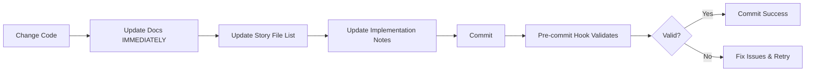

# Documentation Consistency System - Complete Summary

**Implementation Date:** 2025-10-06
**Status:** ✅ Complete and Active

---

## 🎯 Mission Accomplished

A global documentation consistency system has been implemented to ensure the [docs/](docs/) folder **always** reflects the current state of the codebase and analysis.

---

## 🚨 The Golden Rule (Most Important)

**[→ docs/GOLDEN-RULE.md](docs/GOLDEN-RULE.md)**

> **If you change it, document it. If you analyze it, document it. If you discover it, document it. IMMEDIATELY.**

This simple rule is the foundation. Everything else is support structure.

---

## 📦 What Was Delivered

### 1. Core Documentation

| File | Purpose | When to Use |
|------|---------|-------------|
| [docs/GOLDEN-RULE.md](docs/GOLDEN-RULE.md) | 🚨 **READ FIRST** - The fundamental principle | Before every coding session |
| [docs/DOCUMENTATION-CONSISTENCY-RULES.md](docs/DOCUMENTATION-CONSISTENCY-RULES.md) | Complete rules and scenarios | When you need detailed guidance |
| [docs/REVIEW-CHECKLIST.md](docs/REVIEW-CHECKLIST.md) | Manual validation checklist | Before marking stories "Done" |

### 2. Automation & Scripts

| File | Purpose | When It Runs |
|------|---------|--------------|
| [.git/hooks/pre-commit](.git/hooks/pre-commit) | Validates doc completeness | Automatically on every commit |
| [docs/scripts/check-story-gates.sh](docs/scripts/check-story-gates.sh) | Verify Done stories have gates | Weekly audit |
| [docs/scripts/check-file-lists.sh](docs/scripts/check-file-lists.sh) | Verify Review stories have File Lists | Weekly audit |
| [docs/scripts/doc-coverage-report.sh](docs/scripts/doc-coverage-report.sh) | Generate coverage metrics | Weekly audit |
| [docs/scripts/README.md](docs/scripts/README.md) | Script documentation | Reference |

### 3. Updated Existing Docs

| File | What Changed |
|------|--------------|
| [docs/DOCUMENTATION-MAP.md](docs/DOCUMENTATION-MAP.md) | Added Golden Rule section, updated Quick Links |
| [docs/architecture/development-workflow.md](docs/architecture/development-workflow.md) | Added comprehensive "Documentation Requirements" section |

---

## 🔄 How It Works

### For Developers



**Key Actions:**
1. **During coding:** Update File List and Implementation Notes as you go
2. **Before Review:** Ensure story is complete with all sections
3. **On commit:** Pre-commit hook validates automatically

### For QA/Test Architect

```bash
# Run review command
/BMad/tasks/review-story

# This automatically:
# ✅ Validates story completeness
# ✅ Checks File List accuracy
# ✅ Adds QA Results section
# ✅ Creates quality gate file
# ✅ Recommends status change
```

### For Scrum Master

```bash
# Weekly audit (run these every Friday)
./docs/scripts/doc-coverage-report.sh
./docs/scripts/check-story-gates.sh
./docs/scripts/check-file-lists.sh
```

---

## 📋 The Rules in Action

### When to Update Docs

| Trigger | Documentation Action |
|---------|---------------------|
| **Code changed** | Update story File List, Implementation Notes |
| **API changed** | Update API specification docs |
| **DB changed** | Update database schema docs |
| **Pattern discovered** | Update architecture or context docs |
| **Library upgraded** | Update context docs via MCP |
| **Requirement clarified** | Update PRD and story ACs |
| **Issue found** | Document in relevant area + story notes |
| **Decision made** | Document rationale in architecture |
| **Status changed** | Ensure all required sections complete |

### Story Status Requirements

| Status | Required Documentation |
|--------|----------------------|
| **Review** | ✅ Complete File List<br>✅ Implementation Notes<br>✅ All ACs addressed<br>✅ Architecture/context docs updated (if changed) |
| **Done** | ✅ Everything from Review<br>✅ QA Results section<br>✅ Quality gate file in docs/qa/gates/ |
| **Blocked** | ✅ Blockers section<br>✅ Related docs updated if issue reveals design problem |

---

## 🛡️ Enforcement Layers

### Layer 1: Mindset (Most Important)
- **The Golden Rule** - Update docs immediately
- Read [docs/GOLDEN-RULE.md](docs/GOLDEN-RULE.md) before every session
- Make it a habit, not a chore

### Layer 2: Automation
- **Pre-commit hook** - Catches issues before commit
- **Review command** - Validates during QA
- **Audit scripts** - Weekly verification

### Layer 3: Team Process
- **Code review** - Check docs in PR review
- **Weekly audits** - SM runs scripts, reports metrics
- **Team culture** - Everyone enforces the rule

---

## 📊 Success Metrics

Track these weekly:

| Metric | Target | How to Check |
|--------|--------|--------------|
| Stories with complete File Lists | 100% | `./docs/scripts/check-file-lists.sh` |
| Done stories with quality gates | 100% | `./docs/scripts/check-story-gates.sh` |
| Documentation coverage | 100% | `./docs/scripts/doc-coverage-report.sh` |
| Review rework rate | < 20% | Manual tracking |
| Pre-commit hook compliance | 100% | No --no-verify usage |

---

## 🎓 Quick Start Guide

### For New Team Members

1. **Read these in order:**
   - [docs/GOLDEN-RULE.md](docs/GOLDEN-RULE.md) - **THE FOUNDATION** 🚨
   - [docs/DOCUMENTATION-CONSISTENCY-RULES.md](docs/DOCUMENTATION-CONSISTENCY-RULES.md) - Detailed rules
   - [docs/REVIEW-CHECKLIST.md](docs/REVIEW-CHECKLIST.md) - What to check

2. **Understand the workflow:**
   - See [docs/architecture/development-workflow.md](docs/architecture/development-workflow.md)
   - Focus on "Documentation Requirements" section

3. **Try the automation:**
   - Make a test commit - see pre-commit hook in action
   - Run audit scripts - see what they check

### For Existing Team Members

1. **Adopt the Golden Rule:**
   - Update docs **immediately** when you change/analyze/discover
   - Not later. Not "when I finish". **Immediately.**

2. **Use the tools:**
   - Let pre-commit hook catch issues
   - Reference checklist before marking stories Done
   - Run audit scripts weekly

---

## 🚫 Common Anti-Patterns to Avoid

| ❌ Don't Do This | ✅ Do This Instead |
|-----------------|-------------------|
| "I'll update docs later" | Update docs immediately |
| "Story says Review but File List empty" | Complete File List before Review status |
| "Code changed but docs still show old way" | Update architecture docs when pattern changes |
| "Bypassing pre-commit with --no-verify" | Fix the issues, then commit |
| "Marking Done without QA review" | Wait for QA Results and quality gate |
| "Forgetting to add files to File List" | Update File List as you create/modify files |

---

## 🔍 Real-World Examples

### Example 1: API Endpoint Changed
```markdown
Developer checklist:
✅ Changed code: POST /sync → POST /api/v1/sync
✅ Updated docs/architecture/api-specification.md
✅ Added to story File List: "api-specification.md - Updated endpoint"
✅ Added to Implementation Notes: "Changed to versioned API endpoint"
✅ Committed (pre-commit hook validates)
```

### Example 2: Performance Issue Discovered
```markdown
Developer checklist:
✅ Found: Vector search takes 3s instead of <500ms
✅ Updated docs/architecture/monitoring.md with known issue
✅ Added to story Implementation Notes: "Performance optimization needed"
✅ Created follow-up story for optimization
✅ Added monitoring doc to story File List
```

### Example 3: Library Upgraded
```markdown
Developer checklist:
✅ Upgraded React Query v4 → v5
✅ Used MCP: mcp__context7__get-library-docs("@tanstack/react-query")
✅ Updated docs/context/frontend/react-query-patterns.md
✅ Updated docs/architecture/tech-stack.md with new version
✅ Updated all affected code
✅ Added all files to story File List
✅ Noted upgrade in Implementation Notes
```

---

## 🆘 Troubleshooting

### Pre-commit hook fails
```bash
# Read the error message
# Fix the specific issue it identifies
# Try commit again
# Never use --no-verify (defeats the purpose)
```

### Missing quality gate file
```bash
# Don't manually create it
# Run: /BMad/tasks/review-story
# This creates it properly with all validations
```

### File List incomplete
```bash
# Run: git diff --name-only
# Compare with story File List
# Add any missing files
```

---

## 📚 Complete File List

### Created Files
- ✅ [docs/GOLDEN-RULE.md](docs/GOLDEN-RULE.md) - **THE FOUNDATION**
- ✅ [docs/DOCUMENTATION-CONSISTENCY-RULES.md](docs/DOCUMENTATION-CONSISTENCY-RULES.md) - Complete rules
- ✅ [docs/REVIEW-CHECKLIST.md](docs/REVIEW-CHECKLIST.md) - Review checklist
- ✅ [.git/hooks/pre-commit](.git/hooks/pre-commit) - Automated validation
- ✅ [docs/scripts/check-story-gates.sh](docs/scripts/check-story-gates.sh) - Gate file checker
- ✅ [docs/scripts/check-file-lists.sh](docs/scripts/check-file-lists.sh) - File List checker
- ✅ [docs/scripts/doc-coverage-report.sh](docs/scripts/doc-coverage-report.sh) - Coverage report
- ✅ [docs/scripts/README.md](docs/scripts/README.md) - Scripts documentation
- ✅ [docs/SETUP-DOCUMENTATION-SYSTEM.md](docs/SETUP-DOCUMENTATION-SYSTEM.md) - Setup details
- ✅ [DOCUMENTATION-SYSTEM-SUMMARY.md](DOCUMENTATION-SYSTEM-SUMMARY.md) - This file

### Modified Files
- ✅ [docs/DOCUMENTATION-MAP.md](docs/DOCUMENTATION-MAP.md) - Added Golden Rule section
- ✅ [docs/architecture/development-workflow.md](docs/architecture/development-workflow.md) - Added doc requirements

---

## 🎉 What This Achieves

### For the Team
- ✅ **Trust** - Docs are always accurate
- ✅ **Velocity** - No time wasted on outdated info
- ✅ **Quality** - Inconsistencies caught early
- ✅ **Onboarding** - New members get truth, not fiction
- ✅ **Debugging** - Actual behavior is documented

### For AI Agents
- ✅ **Clear reminder** - Update docs immediately, always
- ✅ **Concrete examples** - Real scenarios showing what to update
- ✅ **Automation support** - Tools catch issues automatically
- ✅ **Validation** - Pre-commit and review commands verify compliance

### For the Project
- ✅ **Documentation as code** - Docs are first-class citizens
- ✅ **Continuous accuracy** - Docs reflect reality at all times
- ✅ **Reduced technical debt** - No documentation drift
- ✅ **Better handoffs** - Complete, accurate information transfers

---

## 🔮 Next Steps

### Immediate (Today)
1. ✅ **All team members:** Read [docs/GOLDEN-RULE.md](docs/GOLDEN-RULE.md)
2. ✅ **All team members:** Bookmark it, reference before every session
3. ✅ **Developers:** Test pre-commit hook with a test commit
4. ✅ **SM:** Schedule weekly audit for Fridays

### Ongoing (Every Day)
1. ✅ **Everyone:** Apply the Golden Rule - update docs immediately
2. ✅ **Developers:** Keep story File List current as you code
3. ✅ **QA:** Use /BMad/tasks/review-story for all reviews
4. ✅ **SM:** Monitor compliance, coach team

### Weekly (Every Friday)
1. ✅ **SM:** Run audit scripts
2. ✅ **SM:** Report metrics to team
3. ✅ **Team:** Review any violations, improve process

---

## 📞 Support

### Questions?
- See [docs/DOCUMENTATION-CONSISTENCY-RULES.md](docs/DOCUMENTATION-CONSISTENCY-RULES.md) for detailed scenarios
- Check [docs/REVIEW-CHECKLIST.md](docs/REVIEW-CHECKLIST.md) for validation steps
- Ask team lead or SM

### Issues?
- Pre-commit hook issues: Check [docs/scripts/README.md](docs/scripts/README.md)
- Story completeness: See [docs/DOCUMENTATION-CONSISTENCY-RULES.md](docs/DOCUMENTATION-CONSISTENCY-RULES.md)
- Process questions: Ask SM

---

## 🏁 Final Word

**Documentation is not an afterthought. It's a first-class citizen.**

**The Golden Rule: If you change/analyze/discover anything → UPDATE DOCS IMMEDIATELY.**

**This is the foundation of our quality system. Make it a habit.**

---

✅ **System is live and active. Let's keep our docs current!** 🚀
