# BMADFlow Documentation Map

> **Quick Reference**: Where to find what you need

---

## 🚨 READ FIRST: The Golden Rule

**[→ GOLDEN-RULE.md](GOLDEN-RULE.md) - READ BEFORE EVERY CODING SESSION**

> **The [docs/](docs/) folder MUST always reflect the current state of the codebase and analysis.**
>
> **If you change it, document it. If you analyze it, document it. If you discover it, document it. IMMEDIATELY.**

This is not optional. This is the foundation of our documentation system.

---

## 📚 Documentation Hierarchy

```mermaid
graph TB
    MCP[🤖 MCP Services<br/>context7, shadcn<br/>Official Library Docs]

    CONTEXT[📥 docs/context/<br/>External Patterns<br/>MOST AUTHORITATIVE]

    ARCH[🏗️ docs/architecture/<br/>System Design<br/>High-Level Patterns]

    PRD[📋 docs/prd.md<br/>Requirements<br/>What to Build]

    UX[🎨 docs/ux-specification.md<br/>User Experience<br/>How It Looks]

    CODE[💻 Implementation<br/>backend/app/<br/>frontend/src/]

    MCP -->|Populates| CONTEXT
    CONTEXT -->|Referenced by| ARCH
    PRD -->|Drives| ARCH
    UX -->|Drives| ARCH
    ARCH -->|Guides| CODE
    CONTEXT -->|Patterns for| CODE

    classDef mcp fill:#6c757d,stroke:#6c757d,color:#fff
    classDef context fill:#0969da,stroke:#0969da,color:#fff
    classDef arch fill:#bf8700,stroke:#bf8700,color:#fff
    classDef prd fill:#8250df,stroke:#8250df,color:#fff
    classDef impl fill:#1a7f37,stroke:#1a7f37,color:#fff

    class MCP mcp
    class CONTEXT context
    class ARCH arch
    class PRD,UX prd
    class CODE impl
```



---

## 🎯 Where Do I Go?

### "I'm implementing a feature"

1. **Check Requirements**: [docs/prd.md](prd.md) - What needs to be built?
2. **Check Architecture**: [docs/architecture/](architecture/) - How should it be structured?
3. **Check Context Docs**: [docs/context/](context/) - What patterns should I use?
4. **Implement**: Follow context doc patterns exactly

**Example: Implementing Vector Search**
```bash
# 1. Requirement
cat docs/prd.md  # FR12: RAG with vector search

# 2. Architecture Design
cat docs/architecture/backend-architecture.md  # RAG Pipeline section

# 3. Implementation Patterns (AUTHORITATIVE)
cat docs/context/database/postgresql-pgvector-patterns.md

# 4. Copy pattern and implement
# → Use HNSW index, cosine distance, async queries
```

---

### "I need to understand the system"

**Start here**:
1. [docs/brief.md](brief.md) - Why are we building this?
2. [docs/prd.md](prd.md) - What are we building?
3. [docs/architecture.md](architecture.md) - How is it structured?

---

### "I'm working on the backend"

**Architecture**: [docs/architecture/backend-architecture.md](architecture/backend-architecture.md)
- Service layer, repository pattern, RAG pipeline

**Patterns (AUTHORITATIVE)**: [docs/context/backend/fastapi-patterns.md](context/backend/fastapi-patterns.md)
- Async routes, dependency injection, Pydantic models

**Tech Stack**: [docs/architecture/tech-stack.md](architecture/tech-stack.md)
- FastAPI 0.110+, Python 3.11+, SQLAlchemy 2.x, Pydantic

---

### "I'm working on the frontend"

**Architecture**: [docs/architecture/frontend-architecture.md](architecture/frontend-architecture.md)
- React components, state management, routing

**Patterns (AUTHORITATIVE)**: [docs/context/frontend/shadcn-components.md](context/frontend/shadcn-components.md)
- Table, Card, Form, Dialog, Dashboard layout

**UX Design**: [docs/ux-specification.md](ux-specification.md)
- User flows, component library, branding

---

### "I'm setting up infrastructure"

**Deployment**: [docs/architecture/deployment.md](architecture/deployment.md)
- Docker Compose (Full Docker + Hybrid modes)

**Patterns (AUTHORITATIVE)**: [docs/context/deployment/docker-compose-patterns.md](context/deployment/docker-compose-patterns.md)
- Multi-service orchestration, health checks, volumes

---

### "I'm working with the database"

**Architecture**: [docs/architecture/database-schema.md](architecture/database-schema.md)
- PostgreSQL + pgvector schema, ERD, tables

**Patterns (AUTHORITATIVE)**: [docs/context/database/postgresql-pgvector-patterns.md](context/database/postgresql-pgvector-patterns.md)
- Vector columns, similarity search, HNSW indexes, async queries

---

### "I need to update documentation"

**Context Docs** (external patterns):
- Use MCP services: `mcp__context7__get-library-docs("library")`
- Update when libraries upgrade
- See [docs/context/HOW-TO-USE.md](context/HOW-TO-USE.md)

**Architecture Docs** (system design):
- Update when architecture changes
- Reference context docs for patterns
- See [docs/architecture/code-examples-policy.md](architecture/code-examples-policy.md)

---

## 📖 Documentation Types

| Type | Purpose | Source | Update Frequency |
|------|---------|--------|------------------|
| **Context Docs** | External library patterns | MCP services (context7, shadcn) | When libraries upgrade |
| **Architecture** | System design | Architect | When architecture changes |
| **Requirements** | What to build | Product Manager | When requirements change |
| **UX Design** | How it looks | UX Designer | When design changes |
| **Stories** | Implementation tasks | Derived from PRD | During sprint planning |

---

## 🚨 Critical Rules

### Rule 0: Documentation Must Always Be Current

**The docs/ folder MUST always reflect the current state of the codebase.**

When a dev says "it's on review", the story file MUST be updated with complete, consistent information.

See [DOCUMENTATION-CONSISTENCY-RULES.md](DOCUMENTATION-CONSISTENCY-RULES.md) for enforcement.

### Rule 1: Context Docs Are Authoritative

When implementing code, **context docs override architecture examples**.

**Authority Order**:
1. [docs/context/](context/) - **MOST AUTHORITATIVE** (external patterns)
2. [docs/architecture/](architecture/) - High-level design
3. MCP services - Latest official docs
4. Official library docs - Deep understanding

### Rule 2: Use MCP for Context Docs

Context docs are **populated by MCP services**, not manually written.

```bash
# ✅ GOOD: Retrieve via MCP
mcp__context7__get-library-docs("fastapi")

# ❌ BAD: Manually copy from website
curl https://fastapi.tiangolo.com > context/fastapi.md
```

### Rule 3: Reference Context Docs in Code

```python
# ✅ GOOD: Reference pattern source
async def get_projects():
    """Pattern: docs/context/backend/fastapi-patterns.md"""
    pass

# ❌ BAD: No reference
async def get_projects():
    pass
```

---

## 📁 Directory Structure

```
docs/
├── DOCUMENTATION-MAP.md          # This file
├── brief.md                      # Business context
├── prd.md                        # Product requirements (65 reqs, 36 stories)
├── ux-specification.md           # UX design
│
├── architecture/                 # System design (18 sections)
│   ├── architecture.md           # Root document
│   ├── backend-architecture.md
│   ├── frontend-architecture.md
│   ├── database-schema.md
│   ├── deployment.md
│   ├── code-examples-policy.md   # 🚨 MANDATORY
│   └── ...
│
├── context/                      # 📥 External patterns (MCP-populated)
│   ├── README.md
│   ├── HOW-TO-USE.md             # Quick start guide
│   ├── backend/
│   │   └── fastapi-patterns.md
│   ├── frontend/
│   │   └── shadcn-components.md
│   ├── database/
│   │   └── postgresql-pgvector-patterns.md
│   └── deployment/
│       └── docker-compose-patterns.md
│
├── stories/                      # User stories (from PRD)
│   ├── story-1-1-initialize-monorepo.md
│   └── ...
│
├── scripts/                      # Documentation audit utilities
│   ├── README.md                 # Scripts documentation
│   ├── check-story-gates.sh      # Verify Done stories have gates
│   ├── check-file-lists.sh       # Verify Review stories have File Lists
│   └── doc-coverage-report.sh    # Generate coverage report
│
├── DOCUMENTATION-CONSISTENCY-RULES.md  # 🚨 Global documentation rules
└── REVIEW-CHECKLIST.md                  # 🚨 Story review checklist
```

---

## 🔗 Quick Links

### Most Important Docs

1. **[GOLDEN-RULE.md](GOLDEN-RULE.md)** - 🚨 **READ FIRST** - Keep docs current always
2. **[Documentation Consistency Rules](DOCUMENTATION-CONSISTENCY-RULES.md)** - 🚨 **MANDATORY** - Detailed rules
3. **[Review Checklist](REVIEW-CHECKLIST.md)** - 🚨 **MANDATORY** - Before marking stories Done
4. **[Code Examples Policy](architecture/code-examples-policy.md)** - 🚨 **MANDATORY** reading
5. **[Context HOW-TO-USE](context/HOW-TO-USE.md)** - How to use external patterns
6. **[Architecture Overview](architecture.md)** - System design
7. **[Tech Stack](architecture/tech-stack.md)** - Technology choices
8. **[PRD](prd.md)** - Requirements and stories

### Common Tasks

| Task | Documentation |
|------|---------------|
| Update story documentation | [DOCUMENTATION-CONSISTENCY-RULES.md](DOCUMENTATION-CONSISTENCY-RULES.md) |
| Review story before Done | [REVIEW-CHECKLIST.md](REVIEW-CHECKLIST.md) |
| Setup dev environment | [deployment.md](architecture/deployment.md) |
| Implement API endpoint | [fastapi-patterns.md](context/backend/fastapi-patterns.md) |
| Build UI component | [shadcn-components.md](context/frontend/shadcn-components.md) |
| Work with vector search | [postgresql-pgvector-patterns.md](context/database/postgresql-pgvector-patterns.md) |
| Write tests | [testing-strategy.md](architecture/testing-strategy.md) |
| Fix errors | [error-handling.md](architecture/error-handling.md) |
| Run weekly audit | [scripts/README.md](scripts/README.md) |

---

## 🎓 Learning Path

### New to Project

1. Read [GOLDEN-RULE.md](GOLDEN-RULE.md) - **THE FOUNDATION** 🚨
2. Read [brief.md](brief.md) - Why this exists
3. Read [prd.md](prd.md) - What we're building
4. Read [architecture.md](architecture.md) - How it's structured
5. Read [DOCUMENTATION-CONSISTENCY-RULES.md](DOCUMENTATION-CONSISTENCY-RULES.md) - **MANDATORY**
6. Read [code-examples-policy.md](architecture/code-examples-policy.md) - **MANDATORY**
7. Start implementing!

### Before Implementing Feature

1. Find story in [docs/stories/](stories/)
2. Review architecture section relevant to feature
3. Check context doc for implementation patterns
4. Use MCP if context doc insufficient
5. Implement following context doc patterns

### During Development

1. **Update story File List** as you create/modify files
2. Reference context docs for patterns
3. Update context docs if libraries change
4. Add code comments referencing patterns
5. Keep architecture updated if design changes
6. **Update story Implementation Notes** describing what you're building

---

**Remember**:
1. **THE GOLDEN RULE**: Update docs immediately when you change/analyze/discover anything 🚨
2. Context docs ([docs/context/](context/)) are populated by MCP services and are the **authoritative source** for implementation patterns! 📚✨

---
