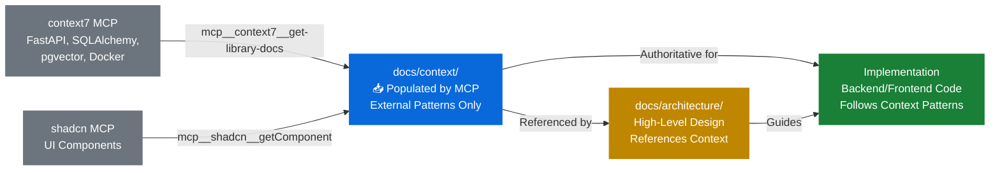

# Code Examples Policy

## Overview

This document establishes **mandatory rules** for ensuring consistency between code examples in architecture documentation ([docs/architecture/](../architecture/)) and implementation patterns in context documentation ([docs/context/](../context/)). All developers and AI agents working on BMADFlow must follow these policies.

> **📥 IMPORTANT**: The [docs/context/](../context/) directory is **populated by MCP services** (context7, shadcn) with official library documentation. Context docs contain external patterns from FastAPI, shadcn/ui, PostgreSQL, pgvector, and Docker Compose - NOT BMADFlow-specific code. See [Understanding docs/context/](#-understanding-docscontext) below.

---

## 🎯 Core Principle

**All code examples in architecture documents MUST align with patterns defined in context documentation.**

When discrepancies exist:
1. Context documentation ([docs/context/](../context/)) is the **authoritative source**
2. Architecture documentation provides **high-level patterns**
3. Context documentation provides **production-ready implementation**

---

## 📚 Understanding docs/context/

**Purpose**: The `docs/context/` directory contains **downloaded external documentation** from official library sources that BMADFlow uses frequently.

### Documentation Flow Diagram



**Key Points:**
- 🤖 **MCP Services** populate `docs/context/` with official library patterns
- 📖 **Context docs** are authoritative for implementation
- 🏗️ **Architecture docs** reference context docs for detailed patterns
- 💻 **Implementation** follows context doc patterns exactly

### What docs/context/ Contains

✅ **External Documentation** (downloaded from official sources):
- FastAPI patterns (async routes, dependency injection, Pydantic models)
- shadcn/ui component patterns (Table, Card, Form, Dialog, Dashboard)
- PostgreSQL + pgvector patterns (vector columns, similarity search, HNSW indexes)
- Docker Compose patterns (multi-service orchestration, health checks, volumes)

✅ **Production-Ready Examples**:
- Adapted to BMADFlow's architecture
- Copy-paste ready code snippets
- Best practices from official documentation

✅ **Retrieved via MCP Services**:
- `mcp__context7__get-library-docs("fastapi")` → fastapi-patterns.md
- `mcp__shadcn__getComponent("table")` → shadcn-components.md
- Retrieved once, used throughout development

### What docs/context/ Does NOT Contain

❌ **BMADFlow-Specific Code**:
- Business logic (belongs in `/backend/app/services/`)
- Custom components (belongs in `/frontend/src/features/`)
- Application-specific implementations
- Internal architectural decisions (those go in `docs/architecture/`)

### Maintaining Context Docs During Development

**Context docs MUST be updated when:**

1. **Library Version Upgrades**
   ```bash
   # FastAPI upgraded from 0.110 → 0.115
   # Retrieve latest patterns via MCP
   mcp__context7__get-library-docs("fastapi")
   # Update docs/context/backend/fastapi-patterns.md
   ```

2. **Better Official Patterns Discovered**
   ```bash
   # During implementation, developer finds improved pattern
   # Check official docs via MCP
   mcp__shadcn__getComponent("data-table")
   # Update docs/context/frontend/shadcn-components.md
   # Add comment: "Updated 2025-10-06: Added server-side pagination"
   ```

3. **MCP Services Provide New Patterns**
   ```bash
   # context7 MCP has updated pgvector documentation
   mcp__context7__get-library-docs("pgvector")
   # Compare with existing docs/context/database/postgresql-pgvector-patterns.md
   # Update if official patterns have improved
   ```

4. **Production Issues Reveal Better Approaches**
   ```bash
   # Performance issue: N+1 queries in production
   # Find official SQLAlchemy solution via MCP
   mcp__context7__get-library-docs("sqlalchemy")
   # Update docs/context/database/postgresql-pgvector-patterns.md
   # Add section: "Avoiding N+1 Queries with joinedload"
   ```

### Updating Context Docs Workflow

```bash
# 1. Identify need for update
# → Library upgraded, or pattern insufficient

# 2. Retrieve latest documentation via MCP
mcp__context7__get-library-docs("library-name")
# OR
mcp__shadcn__getComponent("component-name")

# 3. Review retrieved documentation
# → Compare with existing context doc

# 4. Update context doc
vim docs/context/path/to/pattern-doc.md

# 5. Add changelog entry
# Example:
## Updated 2025-10-06: FastAPI 0.115 Dependency Injection
- Added: Annotated[] syntax for clearer dependencies
- Reason: FastAPI 0.115 best practice
- Source: Retrieved via mcp__context7__get-library-docs("fastapi")

# 6. Update architecture references if needed
# → If pattern significantly changes, update architecture.md references
```

---

## Mandatory Rules

### Rule 1: Verify Consistency Before Implementation

**BEFORE implementing any feature, developers MUST:**

1. **Check Architecture Document** for high-level design
   - Location: [docs/architecture/](../architecture/)
   - Purpose: Understand system design, patterns, and structure

2. **Check Context Documentation** for implementation details
   - Location: [docs/context/](../context/)
   - Purpose: Get copy-paste ready code examples

3. **Resolve Discrepancies** by following context docs (authoritative)

**Example Workflow:**

```bash
# 1. Review architecture for vector search design
docs/architecture/backend-architecture.md (RAG Pipeline section)

# 2. Check context docs for implementation
docs/context/database/postgresql-pgvector-patterns.md

# 3. Implement using context doc patterns (authoritative)
# Context doc shows: pgvector extension, HNSW index, cosine distance
# → Use these exact patterns in implementation
```

---

### Rule 2: Use Context Documentation Patterns

**All implementations MUST use patterns from context documentation:**

| Feature Area | Context Doc | Use For |
|--------------|-------------|---------|
| **API Endpoints** | [fastapi-patterns.md](../context/backend/fastapi-patterns.md) | Async routes, dependency injection, Pydantic models, error handling |
| **UI Components** | [shadcn-components.md](../context/frontend/shadcn-components.md) | Table, Card, Form, Dialog, Dashboard layout |
| **Vector Search** | [postgresql-pgvector-patterns.md](../context/database/postgresql-pgvector-patterns.md) | pgvector setup, similarity search, HNSW indexing |
| **Docker Services** | [docker-compose-patterns.md](../context/deployment/docker-compose-patterns.md) | Multi-service orchestration, health checks, volumes |

**Examples:**

#### ❌ BAD: Implementing without checking context docs
```python
# Developer writes custom async route handler without checking patterns
@router.get("/projects")
def get_projects():  # ❌ Missing async, no dependency injection
    db = get_db()  # ❌ Direct DB access
    return db.query(Project).all()
```

#### ✅ GOOD: Following context doc patterns
```python
# Developer checks docs/context/backend/fastapi-patterns.md first
@router.get("/projects", response_model=List[ProjectResponse])
async def get_projects(
    db: AsyncSession = Depends(get_db),
    project_repo: ProjectRepository = Depends(get_project_repository)
):
    """List all projects (follows fastapi-patterns.md)."""
    projects = await project_repo.list_all()
    return projects
```

---

### Rule 3: Use MCP Services for Up-to-Date Documentation

**When context docs are insufficient or outdated, developers MUST use MCP services:**

#### MCP Services Available

1. **context7 MCP**: Technical library documentation
   - Use for: FastAPI, SQLAlchemy, React, TypeScript, Pydantic, pgvector
   - Command: `mcp__context7__get-library-docs`
   - Example: Get latest FastAPI async patterns

2. **shadcn MCP**: shadcn/ui component documentation
   - Use for: Table, Card, Form, Dialog, Button, etc.
   - Command: `mcp__shadcn__getComponent`
   - Example: Get Table component with pagination

#### When to Use MCP Services

**REQUIRED:**
- When implementing a feature not covered in context docs
- When context doc patterns seem outdated (>6 months)
- When official library documentation has major updates
- When debugging library-specific issues

**Workflow:**

```bash
# 1. Check context docs first
cat docs/context/frontend/shadcn-components.md

# 2. If insufficient, use MCP service
# AI Agent: "I need data table with server-side pagination"
# → Use mcp__shadcn__getComponent("table")
# → Get official shadcn/ui Table patterns

# 3. Implement using official patterns from MCP
# → Code follows latest shadcn/ui best practices

# 4. (Optional) Update context doc with new pattern
# → Keep context docs current for future developers
```

---

### Rule 4: Architecture Examples Must Reference Context Docs

**All code examples in architecture documents MUST include references to context docs:**

#### ✅ GOOD: Architecture example with context reference
```python
# From docs/architecture/backend-architecture.md

# Example: Vector Similarity Search
# See detailed implementation: docs/context/database/postgresql-pgvector-patterns.md

async def similarity_search(query_embedding: List[float], top_k: int = 5):
    """
    Perform pgvector cosine similarity search.
    Implementation pattern from postgresql-pgvector-patterns.md
    """
    query = select(Chunk).order_by(
        Chunk.embedding.cosine_distance(query_embedding)
    ).limit(top_k)
    return await db.execute(query)
```

#### ❌ BAD: Architecture example without context reference
```python
# No reference to implementation patterns
async def search(query):
    # How should this be implemented? Developer must guess.
    pass
```

---

### Rule 5: Keep Context Docs Updated

**When implementing features, developers MUST update context docs if:**

1. **New patterns emerge** during implementation
2. **Library versions upgrade** (major version changes)
3. **MCP service provides updated patterns** that differ from context docs
4. **Production debugging reveals better approaches**

**Update Workflow:**

```bash
# 1. Implement feature using context doc pattern
# 2. Discover improved pattern during development
# 3. Retrieve latest official pattern via MCP
mcp__context7__get-library-docs("library-name")
# 4. Update context doc with new pattern
# 5. Add changelog entry explaining why pattern changed
# 6. Update architecture doc references if needed
```

**Example Update:**

```markdown
## SQLAlchemy Async Session Management

<!-- docs/context/database/postgresql-pgvector-patterns.md -->

### ✅ UPDATED PATTERN (v2.0+)

Use `async_sessionmaker` for better type hints:

\`\`\`python
from sqlalchemy.ext.asyncio import async_sessionmaker

async_session = async_sessionmaker(engine, expire_on_commit=False)

async def get_db():
    async with async_session() as session:
        yield session
\`\`\`

**Changed from v1.x**: Previously used `AsyncSession(engine)` directly.
**Reason**: Improved type safety and connection pooling.
**Source**: Retrieved via mcp__context7__get-library-docs("sqlalchemy")
**Updated**: 2025-10-06 (Implementation of Story 1.3)
```

---

### Rule 6: Maintain Context Docs During Development Cycle

**Context docs are living documentation that MUST be maintained throughout the development lifecycle.**

**Maintenance Triggers:**

1. **Sprint Planning**: Check if context docs reflect latest library versions
2. **During Implementation**: Update when discovering better official patterns
3. **Code Review**: Verify context docs are up-to-date before merging
4. **Post-Sprint Retrospective**: Review context doc updates needed
5. **Library Upgrades**: Immediately retrieve latest patterns via MCP

**Lifecycle Maintenance:**

```bash
# Phase 1: Sprint Planning
# → Review context docs for staleness
cat docs/context/backend/fastapi-patterns.md
# → Check library versions in requirements.txt / package.json
# → If major upgrade, retrieve latest patterns

# Phase 2: Active Development
# → Developer implements feature using context doc
# → Discovers improved pattern during implementation
# → Updates context doc immediately (don't wait for PR)

# Phase 3: Code Review
# → Reviewer checks: "Does implementation match context doc?"
# → If not: "Did developer update context doc with new pattern?"
# → If context doc outdated: "Use MCP to retrieve latest, update doc"

# Phase 4: Post-Implementation
# → Update context doc with lessons learned
# → Add "Common Pitfalls" or "Performance Tips" sections
# → Document production issues and their solutions
```

**Context Doc Health Check (Weekly):**

```bash
# 1. Check for outdated patterns
git log docs/context/ --since="1 month ago"
# → If no updates in 1+ months, review for staleness

# 2. Verify against library versions
pip list | grep fastapi  # Check FastAPI version
npm list react  # Check React version
# → Compare with patterns in context docs

# 3. Refresh via MCP if needed
mcp__context7__get-library-docs("fastapi")
mcp__shadcn__getComponent("table")
# → Update context docs with any new patterns

# 4. Review production incidents
# → Any incidents caused by outdated patterns?
# → Update context docs with solutions
```

**Ownership:**

- **Architect**: Reviews context doc consistency quarterly
- **Lead Developer**: Reviews context docs during sprint planning
- **All Developers**: Update context docs when patterns change
- **AI Agents**: Flag outdated patterns, suggest MCP retrieval

---

## Consistency Checklist

**Before committing code, verify:**

- [ ] Code follows patterns from relevant context doc
- [ ] If no context doc exists, MCP service was consulted
- [ ] Architecture examples reference context docs
- [ ] New patterns are documented in context docs
- [ ] Code examples use exact imports/types from context docs
- [ ] Error handling follows context doc patterns
- [ ] Performance optimizations match context doc guidance

---

## Common Scenarios

### Scenario 1: Implementing RAG Vector Search

**Correct Workflow:**

1. **Architecture** → [backend-architecture.md](backend-architecture.md) (RAG Pipeline section)
   - Understand: Docling → Ollama → pgvector flow
   - Pattern: Service layer coordinates embedding generation + storage

2. **Context** → [postgresql-pgvector-patterns.md](../context/database/postgresql-pgvector-patterns.md)
   - Implementation: SQLAlchemy vector column, HNSW index, cosine distance
   - Copy-paste: Similarity search query pattern

3. **Context** → [fastapi-patterns.md](../context/backend/fastapi-patterns.md)
   - Implementation: Async search endpoint with Pydantic models
   - Copy-paste: Repository pattern for database access

4. **MCP (if needed)** → `mcp__context7__get-library-docs("pgvector")`
   - If context doc unclear, get latest official pgvector patterns

**Result**: Vector search implemented with consistent patterns across layers

---

### Scenario 2: Building shadcn/ui Data Table

**Correct Workflow:**

1. **Architecture** → [frontend-architecture.md](frontend-architecture.md) (Components section)
   - Understand: shadcn/ui component structure, props patterns

2. **Context** → [shadcn-components.md](../context/frontend/shadcn-components.md)
   - Implementation: `DocumentTableWithActions` example
   - Copy-paste: Table with sorting, filtering, actions

3. **MCP (if needed)** → `mcp__shadcn__getComponent("table")`
   - If server-side pagination needed (not in context doc)
   - Get official shadcn/ui Table patterns with pagination

4. **Update Context Doc** → Add pagination pattern to shadcn-components.md

**Result**: Data table with pagination following official shadcn/ui patterns

---

### Scenario 3: Docker Compose Health Checks

**Correct Workflow:**

1. **Architecture** → [deployment.md](deployment.md) (Docker Compose section)
   - Understand: Service dependencies, health check requirements

2. **Context** → [docker-compose-patterns.md](../context/deployment/docker-compose-patterns.md)
   - Implementation: Health check configuration examples
   - Copy-paste: PostgreSQL health check pattern

3. **Test** → Verify health checks work in local environment

**Result**: Reliable service startup with proper dependency ordering

---

## Enforcement

### Code Review Checklist

**Reviewers MUST verify:**

1. ✅ Implementation matches context doc patterns
2. ✅ Architecture examples have context doc references
3. ✅ MCP services were used for uncovered scenarios
4. ✅ New patterns are documented in context docs
5. ✅ No custom patterns when context doc exists

### AI Agent Instructions

**All AI agents (PM, Architect, Developer) MUST:**

1. **Read context docs** before generating code examples in architecture
2. **Reference context docs** when explaining implementation patterns
3. **Use MCP services** when context docs are insufficient
4. **Update context docs** when new patterns are discovered
5. **Flag inconsistencies** between architecture and context docs

**Example AI Agent Behavior:**

```
User: "Implement vector similarity search"

AI Agent:
1. Checks: docs/architecture/backend-architecture.md (RAG Pipeline)
2. Checks: docs/context/database/postgresql-pgvector-patterns.md
3. Finds: Complete pgvector pattern with HNSW index
4. Implements: Using exact pattern from context doc
5. References: "Implementation follows postgresql-pgvector-patterns.md"
```

---

## Exception Handling

**Exceptions to these rules require explicit justification:**

**Valid Exceptions:**
- Prototype/spike work (mark as experimental)
- Performance optimization requiring deviation (document why)
- Library bug workaround (document issue tracker link)
- Security fix requiring immediate non-standard approach

**Exception Documentation:**
```python
# EXCEPTION: Custom pgvector distance function
# Reason: Performance optimization for 768-dim embeddings (40% faster)
# Standard pattern: docs/context/database/postgresql-pgvector-patterns.md
# Deviation: Using custom PL/pgSQL function for distance calculation
# Benchmarks: See docs/performance-analysis.md
# Approved: Winston (Architect) - 2025-10-06
def custom_cosine_distance(...):
    pass
```

---

## Quick Reference

### Documentation Hierarchy (Authority Order)

1. **Context Docs** (`docs/context/`) - **MOST AUTHORITATIVE**
   - Production-ready implementation patterns
   - Copy-paste code examples

2. **Architecture Docs** (`docs/architecture/`)
   - High-level design and structure
   - System-wide patterns

3. **MCP Services** (context7, shadcn)
   - Latest official library documentation
   - Use when context docs insufficient

4. **Official Library Docs** (external)
   - Fallback for deep dives
   - Reference for understanding fundamentals

### Commands Reference

**Reading Context Docs:**
```bash
# Check context doc for implementation pattern
cat docs/context/backend/fastapi-patterns.md
cat docs/context/frontend/shadcn-components.md
cat docs/context/database/postgresql-pgvector-patterns.md
cat docs/context/deployment/docker-compose-patterns.md
```

**Populating/Updating Context Docs via MCP:**
```bash
# These commands are executed by AI agents or developers to populate docs/context/

# Retrieve FastAPI documentation
mcp__context7__get-library-docs("fastapi")
# → Output saved to docs/context/backend/fastapi-patterns.md

# Retrieve shadcn/ui component patterns
mcp__shadcn__getComponent("table")
# → Output saved to docs/context/frontend/shadcn-components.md

# Retrieve PostgreSQL + pgvector patterns
mcp__context7__get-library-docs("pgvector")
# → Output saved to docs/context/database/postgresql-pgvector-patterns.md

# Retrieve SQLAlchemy async patterns
mcp__context7__get-library-docs("sqlalchemy")
# → Merged into docs/context/database/postgresql-pgvector-patterns.md

# Retrieve Docker Compose patterns
mcp__context7__get-library-docs("docker-compose")
# → Output saved to docs/context/deployment/docker-compose-patterns.md
```

**Manual Updates (After MCP Retrieval):**
```bash
# After MCP retrieval, adapt patterns to BMADFlow architecture
vim docs/context/backend/fastapi-patterns.md
# Add BMADFlow-specific adaptations (port numbers, type hints, etc.)
# Add changelog entry with MCP retrieval date
```

---

## Related Documentation

- **Context Documentation**: [/docs/context/README.md](../context/README.md)
- **Architecture Overview**: [/docs/architecture.md](../architecture.md)
- **Coding Standards**: [coding-standards.md](coding-standards.md)
- **Development Workflow**: [development-workflow.md](development-workflow.md)

---

**Document Version**: 1.0
**Last Updated**: 2025-10-06
**Status**: ✅ Mandatory Policy

---
