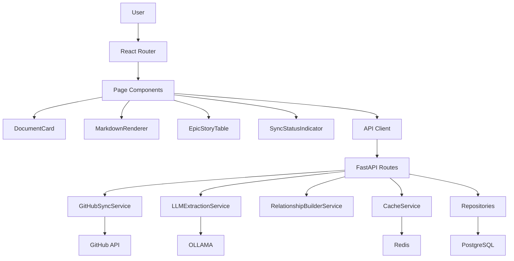

# Components Architecture

## Frontend Components

**Core Components:**

1. **DocumentCard** - Reusable card for document previews (Scoping/Architecture views)
   - Dependencies: shadcn/ui Card, StatusBadge, Lucide Icons
   - Props: `{document: Document, onClick: (id) => void}`

2. **MarkdownRenderer** - Renders markdown with syntax highlighting, Mermaid diagrams, copy buttons
   - Dependencies: react-markdown, Mermaid.js, Prism.js, DOMPurify
   - Props: `{content: string, enableMermaid: boolean, enableTOC: boolean}`

3. **TableOfContents** - Auto-generated TOC from markdown headings with smooth scroll
   - Dependencies: React hooks, Intersection Observer
   - Props: `{content: string, enableActiveTracking: boolean}`

4. **EpicStoryTable** - Hierarchical table of epic-story relationships with expandable rows
   - Dependencies: shadcn/ui Table, StatusBadge
   - Props: `{graphData: GraphData, onNodeClick: (id) => void}`

5. **StatusBadge** - Color-coded status indicator (draft=gray, dev=blue, done=green)
   - Dependencies: shadcn/ui Badge
   - Props: `{status: 'draft' | 'dev' | 'done', size: 'sm' | 'md'}`

6. **SyncStatusIndicator** - Header widget with last sync timestamp and "Sync Now" button
   - Dependencies: React Query polling, shadcn/ui Toast
   - Props: `{project: Project, onSyncTrigger: () => void}`

## Backend Services

**Core Services:**

1. **GitHubSyncService** - Fetches markdown files from GitHub, stores in DB, triggers extraction
   - Methods: `sync_repository()`, `fetch_repository_tree()`
   - Dependencies: PyGithub, ProjectRepository, DocumentRepository

2. **LLMExtractionService** - OLLAMA-based extraction of structured data (epics, stories, status)
   - Methods: `extract_epic()`, `extract_story()`, `extract_status()`
   - Dependencies: OLLAMA client, Pydantic AI, Repositories

3. **RelationshipBuilderService** - Parses markdown links to build epic→story relationships
   - Methods: `build_relationships()`, `resolve_link()`
   - Dependencies: DocumentRepository, RelationshipRepository

4. **CacheService** - Redis-based caching for API responses (5-min TTL)
   - Methods: `get()`, `set()`, `invalidate_pattern()`
   - Dependencies: redis-py

## Component Interaction Diagram

---
