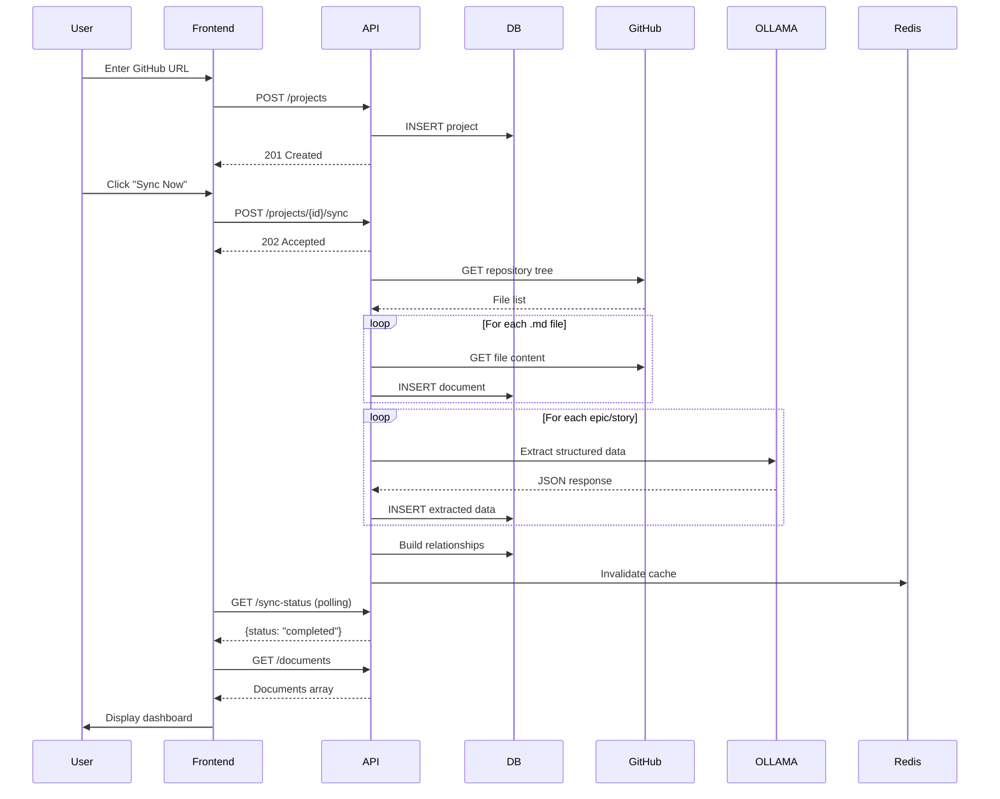
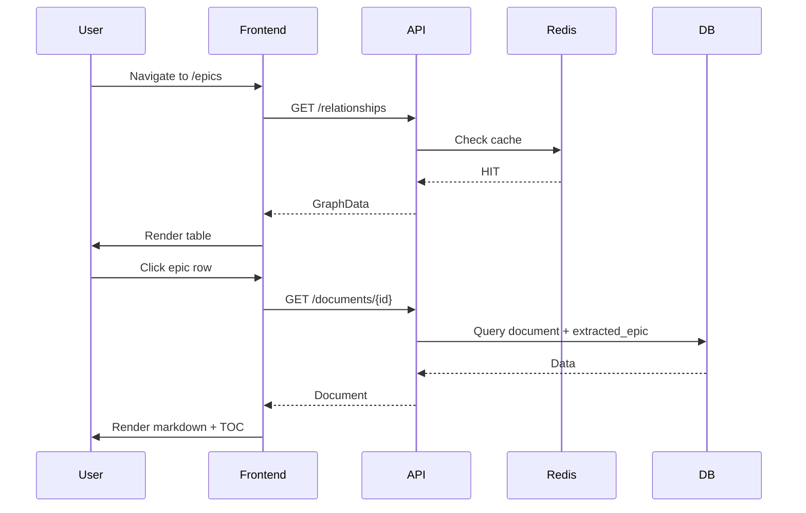

# Core Workflows

## Workflow 1: First-Time Project Setup and Sync

```mermaid
sequenceDiagram
    User->>Frontend: Enter GitHub URL
    Frontend->>API: POST /projects
    API->>DB: INSERT project
    API-->>Frontend: 201 Created

    User->>Frontend: Click "Sync Now"
    Frontend->>API: POST /projects/{id}/sync
    API-->>Frontend: 202 Accepted

    API->>GitHub: GET repository tree
    GitHub-->>API: File list

    loop For each .md file
        API->>GitHub: GET file content
        API->>DB: INSERT document
    end

    loop For each epic/story
        API->>OLLAMA: Extract structured data
        OLLAMA-->>API: JSON response
        API->>DB: INSERT extracted data
    end

    API->>DB: Build relationships
    API->>Redis: Invalidate cache

    Frontend->>API: GET /sync-status (polling)
    API-->>Frontend: {status: "completed"}
    Frontend->>API: GET /documents
    API-->>Frontend: Documents array
    Frontend->>User: Display dashboard
```

## Workflow 2: Navigating from Epics View to Document Detail

```mermaid
sequenceDiagram
    User->>Frontend: Navigate to /epics
    Frontend->>API: GET /relationships
    API->>Redis: Check cache
    Redis-->>API: HIT
    API-->>Frontend: GraphData
    Frontend->>User: Render table

    User->>Frontend: Click epic row
    Frontend->>API: GET /documents/{id}
    API->>DB: Query document + extracted_epic
    DB-->>API: Data
    API-->>Frontend: Document
    Frontend->>User: Render markdown + TOC
```

---
