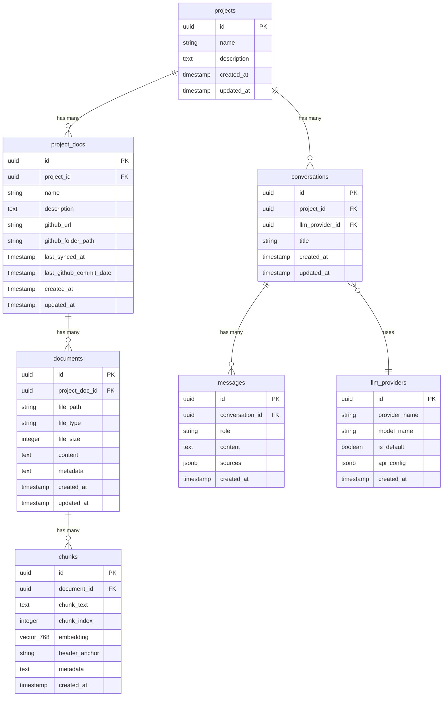

# Database Schema

## Overview

BMADFlow uses **PostgreSQL 15+** with the **pgvector extension** for unified storage of relational data and vector embeddings. The schema supports multi-project organization, GitHub sync tracking, document storage with vector search, RAG chatbot conversations, and LLM provider configuration.

**Key Design Principles:**
- **Project Isolation**: All entities scoped to Projects for multi-tenant data separation
- **Vector Integration**: pgvector columns integrated directly into chunk tables (no separate vector store)
- **Audit Trails**: created_at/updated_at timestamps on all tables
- **GitHub Sync Tracking**: Metadata for sync status and commit versioning
- **Flexible LLM Config**: JSONB storage for provider-specific configuration

## Entity Relationship Diagram



## Table Definitions

### 1. `projects`

**Purpose**: Top-level container for documentation sources and conversations.

| Column | Type | Constraints | Description |
|--------|------|-------------|-------------|
| id | UUID | PRIMARY KEY, DEFAULT gen_random_uuid() | Unique project identifier |
| name | VARCHAR(255) | NOT NULL, UNIQUE | Project display name |
| description | TEXT | NULL | Project description (optional) |
| created_at | TIMESTAMP | NOT NULL, DEFAULT NOW() | Creation timestamp |
| updated_at | TIMESTAMP | NOT NULL, DEFAULT NOW() | Last modification timestamp |

**Indexes:**
- PRIMARY KEY on `id`
- UNIQUE on `name`

**Relationships:**
- 1:N with `project_docs`
- 1:N with `conversations`

---

### 2. `project_docs`

**Purpose**: GitHub repository documentation sources linked to projects.

| Column | Type | Constraints | Description |
|--------|------|-------------|-------------|
| id | UUID | PRIMARY KEY, DEFAULT gen_random_uuid() | Unique project doc identifier |
| project_id | UUID | NOT NULL, FOREIGN KEY → projects(id) ON DELETE CASCADE | Parent project |
| name | VARCHAR(255) | NOT NULL | Display name for this documentation source |
| description | TEXT | NULL | Description (optional) |
| github_url | VARCHAR(512) | NOT NULL | GitHub repository URL |
| github_folder_path | VARCHAR(512) | NULL | Folder path within repo (NULL = root) |
| last_synced_at | TIMESTAMP | NULL | Last successful sync timestamp |
| last_github_commit_date | TIMESTAMP | NULL | Last commit date from GitHub for tracked folder |
| created_at | TIMESTAMP | NOT NULL, DEFAULT NOW() | Creation timestamp |
| updated_at | TIMESTAMP | NOT NULL, DEFAULT NOW() | Last modification timestamp |

**Indexes:**
- PRIMARY KEY on `id`
- FOREIGN KEY on `project_id`
- INDEX on `project_id` (for list queries)

**Relationships:**
- N:1 with `projects`
- 1:N with `documents`

---

### 3. `documents`

**Purpose**: Individual files synced from GitHub (markdown, CSV, YAML, JSON).

| Column | Type | Constraints | Description |
|--------|------|-------------|-------------|
| id | UUID | PRIMARY KEY, DEFAULT gen_random_uuid() | Unique document identifier |
| project_doc_id | UUID | NOT NULL, FOREIGN KEY → project_docs(id) ON DELETE CASCADE | Parent project doc |
| file_path | VARCHAR(1024) | NOT NULL | Relative path within repository |
| file_type | VARCHAR(50) | NOT NULL | File extension (md, csv, yaml, json) |
| file_size | INTEGER | NOT NULL | File size in bytes |
| content | TEXT | NOT NULL | Full file content (stored as text) |
| metadata | JSONB | NULL | Additional metadata (headers, CSV schema, etc.) |
| created_at | TIMESTAMP | NOT NULL, DEFAULT NOW() | Creation timestamp |
| updated_at | TIMESTAMP | NOT NULL, DEFAULT NOW() | Last modification timestamp |

**Indexes:**
- PRIMARY KEY on `id`
- FOREIGN KEY on `project_doc_id`
- INDEX on `(project_doc_id, file_path)` (for file tree queries)
- UNIQUE on `(project_doc_id, file_path)` (prevent duplicate files)

**Relationships:**
- N:1 with `project_docs`
- 1:N with `chunks`

**Notes:**
- File content stored as PostgreSQL TEXT (not BLOB) for markdown/CSV/YAML/JSON
- FR27 specifies document content stored in database (no separate object store)

---

### 4. `chunks`

**Purpose**: Document chunks with vector embeddings for RAG semantic search.

| Column | Type | Constraints | Description |
|--------|------|-------------|-------------|
| id | UUID | PRIMARY KEY, DEFAULT gen_random_uuid() | Unique chunk identifier |
| document_id | UUID | NOT NULL, FOREIGN KEY → documents(id) ON DELETE CASCADE | Parent document |
| chunk_text | TEXT | NOT NULL | Chunk content (text segment) |
| chunk_index | INTEGER | NOT NULL | Order within document (0-based) |
| embedding | VECTOR(768) | NOT NULL | Vector embedding (nomic-embed-text, dim 768) |
| header_anchor | VARCHAR(512) | NULL | Markdown header anchor (#section-name) |
| metadata | JSONB | NULL | Additional metadata (tokens, chunk method, etc.) |
| created_at | TIMESTAMP | NOT NULL, DEFAULT NOW() | Creation timestamp |

**Indexes:**
- PRIMARY KEY on `id`
- FOREIGN KEY on `document_id`
- INDEX on `(document_id, chunk_index)` (for ordered retrieval)
- **VECTOR INDEX (HNSW)** on `embedding` using `vector_cosine_ops` (for similarity search)

**Vector Index Configuration:**
```sql
CREATE INDEX chunks_embedding_idx ON chunks
USING hnsw (embedding vector_cosine_ops)
WITH (m = 16, ef_construction = 64);
```

**Relationships:**
- N:1 with `documents`

**Notes:**
- **Vector dimension is fixed at 768** (nomic-embed-text model) - cannot be changed without recreating table (acceptable per PRD)
- HNSW index recommended for production (NFR4: <500ms search)
- Cosine similarity is default distance function (appropriate for normalized embeddings)

---

### 5. `llm_providers`

**Purpose**: Configured LLM providers for chatbot inference.

| Column | Type | Constraints | Description |
|--------|------|-------------|-------------|
| id | UUID | PRIMARY KEY, DEFAULT gen_random_uuid() | Unique provider identifier |
| provider_name | VARCHAR(50) | NOT NULL | Provider type (openai, google, litellm, ollama) |
| model_name | VARCHAR(100) | NOT NULL | Model identifier (gpt-4, gemini-pro, llama2, etc.) |
| is_default | BOOLEAN | NOT NULL, DEFAULT FALSE | Default provider for new conversations |
| api_config | JSONB | NOT NULL | Provider-specific config (endpoints, params, NOT API keys) |
| created_at | TIMESTAMP | NOT NULL, DEFAULT NOW() | Creation timestamp |

**Indexes:**
- PRIMARY KEY on `id`
- UNIQUE on `(provider_name, model_name)` (prevent duplicates)
- INDEX on `is_default` (for quick default lookup)

**Relationships:**
- 1:N with `conversations`

**Notes:**
- API keys stored in .env, NOT in database (security best practice)
- JSONB `api_config` stores provider-specific settings (base_url, temperature, max_tokens, etc.)
- Only one provider can have `is_default = TRUE` (enforced by application logic)

---

### 6. `conversations`

**Purpose**: Chatbot conversation sessions scoped to projects.

| Column | Type | Constraints | Description |
|--------|------|-------------|-------------|
| id | UUID | PRIMARY KEY, DEFAULT gen_random_uuid() | Unique conversation identifier |
| project_id | UUID | NOT NULL, FOREIGN KEY → projects(id) ON DELETE CASCADE | Scoped project |
| llm_provider_id | UUID | NOT NULL, FOREIGN KEY → llm_providers(id) | LLM provider used |
| title | VARCHAR(255) | NOT NULL | Conversation title (auto-generated or user-set) |
| created_at | TIMESTAMP | NOT NULL, DEFAULT NOW() | Creation timestamp |
| updated_at | TIMESTAMP | NOT NULL, DEFAULT NOW() | Last message timestamp |

**Indexes:**
- PRIMARY KEY on `id`
- FOREIGN KEY on `project_id`
- FOREIGN KEY on `llm_provider_id`
- INDEX on `(project_id, updated_at DESC)` (for recent conversations list)

**Relationships:**
- N:1 with `projects`
- N:1 with `llm_providers`
- 1:N with `messages`

---

### 7. `messages`

**Purpose**: Individual messages in conversations with source attribution.

| Column | Type | Constraints | Description |
|--------|------|-------------|-------------|
| id | UUID | PRIMARY KEY, DEFAULT gen_random_uuid() | Unique message identifier |
| conversation_id | UUID | NOT NULL, FOREIGN KEY → conversations(id) ON DELETE CASCADE | Parent conversation |
| role | VARCHAR(20) | NOT NULL, CHECK (role IN ('user', 'assistant')) | Message role |
| content | TEXT | NOT NULL | Message text content |
| sources | JSONB | NULL | Source documents array (document_id, file_path, header_anchor, score) |
| created_at | TIMESTAMP | NOT NULL, DEFAULT NOW() | Creation timestamp |

**Indexes:**
- PRIMARY KEY on `id`
- FOREIGN KEY on `conversation_id`
- INDEX on `(conversation_id, created_at ASC)` (for chronological message retrieval)

**Relationships:**
- N:1 with `conversations`

**JSONB `sources` Schema Example:**
```json
[
  {
    "document_id": "uuid",
    "file_path": "docs/architecture.md",
    "header_anchor": "#database-schema",
    "similarity_score": 0.87
  }
]
```

**Notes:**
- Role is enum-like (user, assistant) enforced by CHECK constraint
- Sources stored as JSONB array for flexible structure and querying

---

## Migration Strategy

**Tool**: Alembic (requirement FR29)

**Migration Order**:
1. Initial migration: `projects`, `llm_providers` tables
2. Second migration: `project_docs` table (depends on projects)
3. Third migration: `documents` table (depends on project_docs)
4. Fourth migration: Enable pgvector extension + `chunks` table with VECTOR column
5. Fifth migration: `conversations` table (depends on projects + llm_providers)
6. Sixth migration: `messages` table (depends on conversations)

**pgvector Extension Setup**:
```sql
-- Enable pgvector extension (run in first migration or separate migration)
CREATE EXTENSION IF NOT EXISTS vector;
```

**Seed Data**:
- Default Ollama LLM provider (llama2 model) seeded via migration or initialization script

## Performance Considerations

**Vector Search Optimization** (NFR4: <500ms search):
- HNSW index on `chunks.embedding` with tuned parameters (`m=16`, `ef_construction=64`)
- Project-scoped queries to reduce search space
- Consider IVFFlat index as fallback if HNSW build time is excessive

**Query Patterns**:
- File tree queries: Index on `(project_doc_id, file_path)` enables fast hierarchy builds
- Conversation history: Index on `(conversation_id, created_at ASC)` for chronological retrieval
- Recent conversations: Index on `(project_id, updated_at DESC)` for dashboard display

**Connection Pooling**:
- SQLAlchemy async engine with connection pool (see [PostgreSQL patterns](context/database/postgresql-pgvector-patterns.md))
- Pool size: 5-10 connections for POC (3 concurrent users per PRD)

## Data Constraints and Business Rules

**Project Uniqueness**: Project names must be unique across application (enforced by UNIQUE constraint)

**Cascade Deletes**:
- Deleting Project → cascades to project_docs, conversations
- Deleting project_docs → cascades to documents
- Deleting documents → cascades to chunks
- Deleting conversations → cascades to messages

**Sync Idempotency**:
- `UNIQUE(project_doc_id, file_path)` on documents table ensures upsert logic (update if exists, insert if new)

**Vector Dimension Lock-In**:
- Changing embedding model requires dropping and recreating `chunks` table
- Not supported in POC (acceptable per PRD Known Constraints)

## Related Documentation

- **Implementation Guide**: [PostgreSQL+pgvector Patterns](context/database/postgresql-pgvector-patterns.md)
- **SQLAlchemy Models**: See [Data Models](#data-models) section (next)
- **API Endpoints**: See [API Specification](#api-specification) section

---
