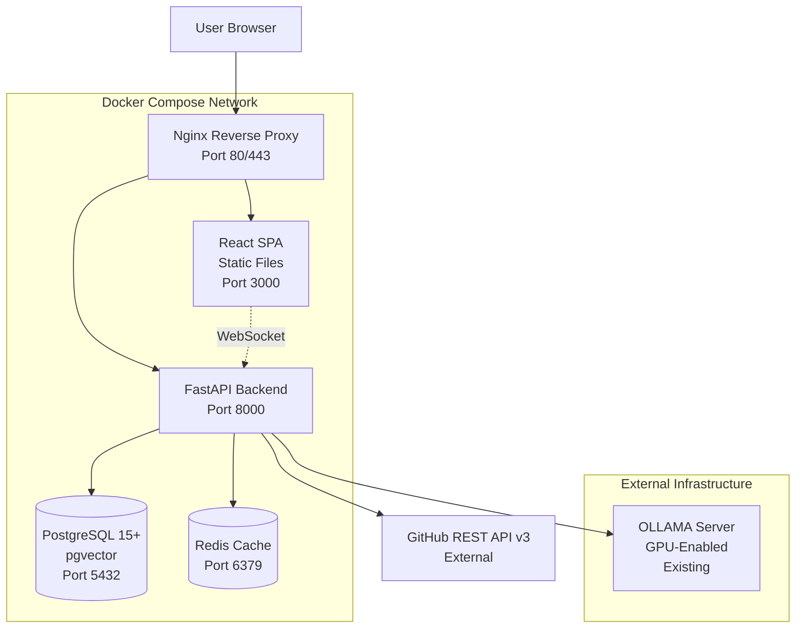

# High Level Architecture

## Technical Summary

BMADFlow is a **modular monolithic SPA + API architecture** deployed via Docker Compose for the POC. The frontend is a React 18+ SPA built with Vite, using shadcn/ui components and React Router for the 4-view dashboard (Scoping, Architecture, Epics, Detail). The backend is a Python FastAPI application with PostgreSQL 15+ (using pgvector for future semantic search) and Redis for caching, integrated with your existing external OLLAMA server for LLM-powered markdown extraction.

The monorepo structure (npm workspaces) enables shared TypeScript interfaces between frontend and backend. Key integration points include RESTful JSON APIs with WebSocket support for real-time sync progress, GitHub API integration for repository fetching, and OLLAMA inference for extracting BMAD-structured content.

Infrastructure runs entirely on self-hosted servers to maintain documentation privacy. This architecture achieves the PRD's 4-6 week POC timeline by balancing functional completeness (90%+ LLM accuracy, 80% navigation time reduction) with pragmatic simplicity.

## Platform and Infrastructure Choice

**Platform:** Self-hosted on project infrastructure (internal/on-prem servers)

**Key Services:**
- **Frontend:** Nginx serving React SPA static build
- **Backend API:** FastAPI + uvicorn (ASGI server)
- **Database:** PostgreSQL 15+ with pgvector extension
- **Cache:** Redis 7+
- **LLM Inference:** External OLLAMA server (existing GPU-enabled server with Llama 3 8B or Mistral 7B, selected via Story 1.7 benchmarking)
- **Reverse Proxy:** Nginx (single entry point for frontend + API)

**Deployment Host and Regions:** Single-region deployment on project infrastructure. OLLAMA runs on existing external GPU server, accessed via HTTP API.

**Rationale:** Self-hosted Docker Compose provides complete control and no cloud costs. External OLLAMA server ensures privacy compliance and leverages existing GPU infrastructure. Architecture designed for cloud migration in Phase 2 (Kubernetes on AWS/GCP).

## Repository Structure

**Structure:** Monorepo (single Git repository)

**Monorepo Tool:** npm workspaces (simplest for 1 developer + AI)

**Package Organization:**
- `apps/web/` - React frontend SPA
- `apps/api/` - FastAPI backend application
- `packages/shared/` - Shared TypeScript types and constants
- `packages/config/` - Shared ESLint, TypeScript, Prettier configs
- `infrastructure/` - Docker Compose, deployment scripts
- `docs/` - Project documentation

## High Level Architecture Diagram

```mermaid
graph TB
    User[User Browser] --> Nginx[Nginx Reverse Proxy<br/>Port 80/443]

    Nginx --> Frontend[React SPA<br/>Static Files<br/>Port 3000]
    Nginx --> API[FastAPI Backend<br/>Port 8000]

    API --> PG[(PostgreSQL 15+<br/>pgvector<br/>Port 5432)]
    API --> Redis[(Redis Cache<br/>Port 6379)]
    API --> GitHub[GitHub REST API v3<br/>External]

    Frontend -.WebSocket.-> API

    subgraph "Docker Compose Network"
        Frontend
        API
        PG
        Redis
        Nginx
    end

    subgraph "External Infrastructure"
        OLLAMA[OLLAMA Server<br/>GPU-Enabled<br/>Existing]
    end

    API --> OLLAMA
```

## Architectural Patterns

- **Modular Monolith (Backend):** Single FastAPI application with modular services - simpler deployment and debugging for POC
- **Single Page Application (Frontend):** React SPA with client-side routing and lazy-loaded route components
- **Repository Pattern (Backend):** Abstract database access behind repository classes for testability and flexibility
- **API Gateway Pattern:** Single Nginx reverse proxy simplifies CORS and provides centralized SSL termination
- **Backend for Frontend (Implicit):** FastAPI endpoints tailored to frontend needs, reducing frontend transformation logic
- **Component-Based UI (Frontend):** Reusable React components with TypeScript, shadcn/ui as base library
- **Service Layer Pattern (Backend):** Business logic in service classes separate from API route handlers

---
