# High Level Architecture

## Technical Summary

BMADFlow employs a **containerized monolithic architecture** optimized for local developer deployment. The system consists of a React SPA frontend communicating with a FastAPI REST backend, both sharing TypeScript type definitions through a monorepo structure. Data persistence utilizes PostgreSQL with the pgvector extension for both relational data and vector embeddings, enabling unified storage for traditional entities and RAG-powered semantic search.

The RAG pipeline integrates Docling for document processing, an external Ollama service for embedding generation, and pgvector for vector similarity search—all scoped to Project contexts for multi-tenant isolation. Docker Compose orchestrates the application stack (frontend, backend, database, pgAdmin) while connecting to the pre-existing Ollama service running on the host machine.

Frontend deployment uses Vite's dev server for hot reload during development, with the shadcn/ui Dashboard template providing a GitHub-inspired aesthetic. The backend exposes a REST API with OpenAPI/Swagger documentation, implementing synchronous request handling with optional background async processing for long-running sync operations. This architecture achieves PRD performance targets (<1s markdown render, <3s cloud LLM / <10s Ollama response, <5min sync, <500ms vector search) while maintaining simplicity appropriate for a 3-user POC.

## Platform and Infrastructure Choice

**Platform:** Local Development Machine (localhost only)

**Rationale:**
NFR5 explicitly mandates "Run on local developer machine only (no cloud hosting for POC)". This eliminates cloud provider selection, focusing architecture on developer machine deployment with Docker Compose orchestration.

**Key Services:**
- **Frontend Hosting:** Vite dev server (development), nginx (future production build)
- **Backend Runtime:** uvicorn ASGI server with FastAPI
- **Database:** PostgreSQL 15+ with pgvector extension (ankane/pgvector Docker image)
- **Database Admin:** pgAdmin web interface (no authentication for POC)
- **Embedding Service:** External Ollama instance - pre-existing, not managed by BMADFlow
- **Containerization:** Docker Desktop with Docker Compose orchestration

**Deployment Host and Regions:**
- **Host:** Local developer workstation (Windows/macOS/Linux with Docker Desktop)
- **Network:** localhost only (no external network exposure)
- **Regions:** N/A (single-machine deployment)

**Infrastructure Considerations:**
- **No Cloud Services:** All infrastructure runs locally; no AWS, Azure, Google Cloud, or Vercel integration
- **Port Allocation:** Fully configurable via .env file to avoid conflicts with existing services
  - **Default ports** (shown in diagrams as examples): Frontend 3000, Backend 8000, PostgreSQL 5432, pgAdmin 5050, Ollama 11434
  - **Configuration**: Environment variables (FRONTEND_PORT, BACKEND_PORT, POSTGRES_PORT, PGADMIN_PORT, OLLAMA_ENDPOINT_URL)
  - **Flexibility**: Any port can be changed if conflicts exist on developer machine
- **Data Persistence:** Docker volumes for PostgreSQL data, ensuring persistence across container restarts
- **External LLM APIs:** Optional cloud LLM providers (OpenAI, Google Gemini, LiteLLM) accessed via API keys in .env files

## Repository Structure

**Structure:** Monorepo

**Monorepo Tool:** Native npm workspaces (no additional tooling like Nx or Turborepo for POC simplicity)

**Package Organization:**
- **Root**: Docker Compose configuration, shared development tooling, root package.json
- **`/backend`**: Python FastAPI application with independent requirements.txt
- **`/frontend`**: React + TypeScript application with independent package.json
- **Shared Code Strategy**: TypeScript types exported from backend and imported by frontend (via relative paths or symlinks) to ensure API contract alignment

**Rationale:**
- **Monorepo Benefits**: Atomic commits spanning frontend/backend, single clone operation, shared documentation location
- **npm Workspaces**: Sufficient for POC; avoids Nx/Turborepo configuration complexity
- **Independent Package Management**: Python (pip) and JavaScript (npm) managed separately, appropriate for polyglot stack
- **Type Sharing**: Backend defines Pydantic models → generate TypeScript types → frontend imports for type-safe API calls

## High Level Architecture Diagrams

### System Context Diagram (C4 Level 1)

This diagram shows BMADFlow in the context of its users and external systems:

```mermaid
graph TB
    USER([👤 Developer/User<br/>3 concurrent users])

    BMADFLOW[🏗️ BMADFlow System<br/>Documentation Hub<br/>React SPA + FastAPI + PostgreSQL]

    GH[📁 GitHub<br/>Public Repositories<br/>Documentation Source]
    OLLAMA[🤖 Ollama<br/>Local Embedding Service<br/>nomic-embed-text model]
    LLM[☁️ Cloud LLM Providers<br/>OpenAI / Google Gemini<br/>LiteLLM / Ollama]

    USER -->|Browse docs<br/>Sync repos<br/>Chat with AI| BMADFLOW

    BMADFLOW -->|Fetch documentation<br/>GitHub API v3<br/>60 req/hr unauthenticated| GH
    BMADFLOW -->|Generate embeddings<br/>HTTP API :11434<br/>768-dim vectors| OLLAMA
    BMADFLOW -->|LLM inference<br/>RAG queries<br/>Optional| LLM

    classDef system fill:#0969da,stroke:#0969da,color:#fff
    classDef external fill:#6c757d,stroke:#6c757d,color:#fff
    classDef user fill:#1a7f37,stroke:#1a7f37,color:#fff

    class BMADFLOW system
    class GH,OLLAMA,LLM external
    class USER user
```

**System Boundary:**
- **BMADFlow System** runs entirely on localhost (no cloud hosting)
- **External Dependencies:** GitHub (documentation source), Ollama (embeddings), Cloud LLMs (optional chat inference)
- **Users:** 3 concurrent developers working on ~10 BMAD projects

---

### Container Diagram (C4 Level 2)

This diagram shows the internal containers/services within BMADFlow:

**Container Responsibilities:**
- **Frontend (React SPA):** File tree navigation, markdown rendering, chat interface, source attribution display
- **Backend (FastAPI):** REST API, GitHub sync orchestration, RAG pipeline (Docling → embeddings → pgvector), Pydantic agents
- **Database (PostgreSQL+pgvector):** Relational data (projects, docs, conversations) + vector embeddings (768-dim chunks)
- **pgAdmin:** Web-based database administration (no auth for POC, localhost only)
- **Ollama:** External embedding service (pre-installed on host, not managed by Docker Compose)

**Note:** Port numbers shown (:3000, :8000, etc.) are configurable defaults via .env variables.

## Architectural Patterns

- **Monolithic REST API:** FastAPI backend as single deployable unit with modular internal structure - _Rationale:_ Appropriate for POC scope (3 users, ~10 projects); avoids microservices complexity while maintaining clear service layer separation

- **Component-Based UI with shadcn/ui:** React functional components using shadcn/ui Dashboard template - _Rationale:_ Accelerates development with pre-built accessible components; GitHub-inspired aesthetic aligns with developer-first UX goals (FR40-42)

- **Repository Pattern (Backend):** Abstract database access behind repository interfaces - _Rationale:_ Enables unit testing with mocked data access; future flexibility for caching or database migration

- **Service Layer (Backend):** Business logic separated from API routes/controllers - _Rationale:_ Keeps route handlers thin; centralizes reusable logic (GitHub sync, RAG query processing, document parsing)

- **API Gateway Pattern (Implicit):** Frontend communicates with backend through unified REST API - _Rationale:_ Single entry point for CORS configuration, request logging, error handling; OpenAPI/Swagger documentation (FR30)

- **RAG (Retrieval-Augmented Generation):** Vector similarity search retrieves relevant chunks before LLM generation - _Rationale:_ Core requirement (FR12); pgvector enables efficient similarity search (<500ms per NFR4)

- **BFF-Light (Backend for Frontend):** TypeScript types shared from backend to frontend via monorepo - _Rationale:_ Type-safe API contracts without code generation complexity; leverages monorepo structure

- **Docker Compose Orchestration:** Multi-container local deployment with service dependencies - _Rationale:_ Consistent environment across developers; supports both Full Docker and Hybrid deployment modes (NFR6)

- **External Service Integration:** Ollama treated as external dependency with health check validation - _Rationale:_ Separates embedding service lifecycle from application deployment; FR32 validates connectivity on startup
