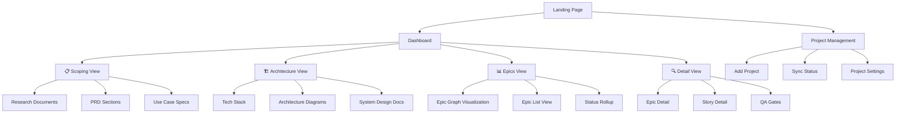
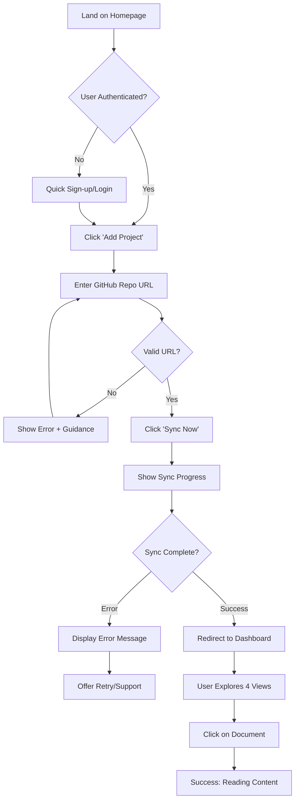
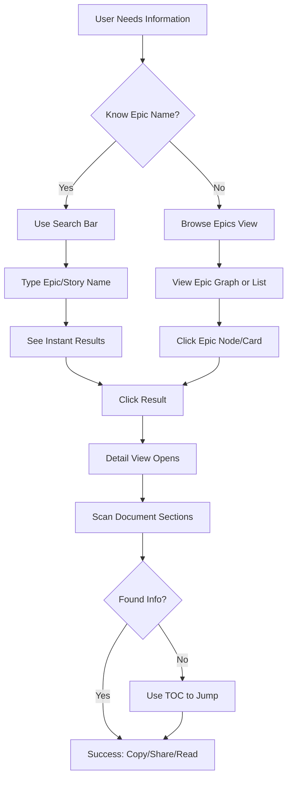
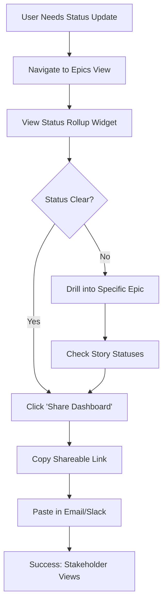
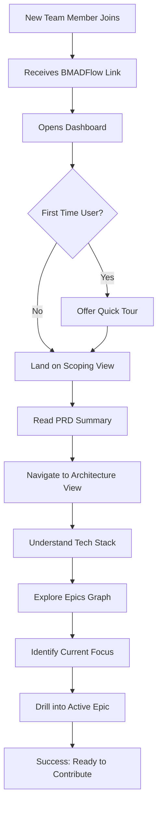

# BMADFlow UI/UX Specification

## Introduction

This document defines the user experience goals, information architecture, user flows, and visual design specifications for **BMADFlow**'s user interface. It serves as the foundation for visual design and frontend development, ensuring a cohesive and user-centered experience.

**Document Status:** ✅ **Ready for Architecture Phase**
**Last Updated:** 2025-10-01 (Enhanced with POC scope alignment per PRD)
**PRD Alignment:** 98% (Validated against [docs/prd.md](docs/prd.md))

### Overall UX Goals & Principles

#### Target User Personas

**Power User - Product Manager:** Technical product professionals who manage complex multi-epic projects using structured methodologies (BMAD, SAFe). They need efficient navigation, quick access to epic/story relationships, and the ability to generate stakeholder updates rapidly. They understand methodology terminology and expect advanced features like graph visualization and semantic search.

**Casual User - Engineering Manager:** Team leads who periodically check project documentation to understand status, architecture decisions, and cross-team dependencies. They prioritize ease of use, clear visual hierarchy, and executive-friendly summaries. They may not be deeply familiar with methodology specifics.

**Administrator - Platform Engineer:** System managers responsible for setting up BMADFlow for multiple teams, managing repository connections, and ensuring documentation compliance. They need control panels, bulk operations, and oversight capabilities across projects.

#### Usability Goals

- **Ease of learning:** New users can complete core tasks (add project, trigger sync, navigate dashboard) within 5 minutes without documentation
- **Efficiency of use:** Power users can find specific epic/story information in under 3 minutes (80% faster than GitHub navigation baseline of 15 minutes)
- **Error prevention:** Clear validation for GitHub URLs, sync status indicators, and confirmation for destructive actions (e.g., removing projects)
- **Memorability:** Infrequent users can return after weeks and navigate without relearning, thanks to familiar patterns and intuitive information architecture
- **Satisfaction:** Visually delightful experience that feels significantly superior to GitHub's documentation UX (target NPS ≥50)

#### Design Principles

1. **Clarity over cleverness** - Prioritize clear communication and intuitive navigation over aesthetic innovation. Users should never wonder "what does this button do?" or "where do I find X?"

2. **Progressive disclosure** - Show only what's needed at each stage. The dashboard presents high-level views first, then allows drilling down into details. Avoid overwhelming users with everything at once.

3. **Consistent patterns** - Use familiar UI patterns throughout the application. Once a user learns how to navigate one view, that knowledge transfers to others (e.g., consistent card layouts, interaction patterns).

4. **Immediate feedback** - Every action should have clear, immediate response. Syncing shows progress, clicks provide visual acknowledgment, errors are explained with actionable guidance.

5. **Accessible by default** - Design for all users from the start. Color contrast ratios meet WCAG AA standards, keyboard navigation works everywhere, screen readers can access all functionality.

#### Change Log

| Date | Version | Description | Author |
|------|---------|-------------|--------|
| 2025-10-01 | 1.0 | Initial UI/UX specification created | Sally (UX Expert) |
| 2025-10-01 | 1.1 | Enhanced with POC scope, component behaviors, Architecture view wireframe | Sally (UX Expert) |

## Information Architecture (IA)

### Site Map / Screen Inventory



### Navigation Structure

**Primary Navigation:** Top-level tab navigation for the 4 core dashboard views (Scoping, Architecture, Epics, Detail). Always visible and accessible from any screen. Uses icons + labels for clarity (📋 Scoping, 🏗️ Architecture, 📊 Epics, 🔍 Detail).

**Secondary Navigation:** Contextual left sidebar that appears within each view, showing document tree, section navigation, or graph filters depending on the active view. Collapsible to maximize content area on smaller screens.

**Breadcrumb Strategy:** Breadcrumbs appear below the primary navigation bar, showing: Project Name > Current View > Specific Document (if applicable). Clicking any breadcrumb segment navigates back to that level. Critical for deep-linked content (e.g., shared URLs to specific epics).

## User Flows

### Flow 1: First-Time Project Setup

**User Goal:** Add a GitHub repository and see documentation visualized in BMADFlow dashboard within 5 minutes

**Entry Points:** Landing page "Add Project" CTA, or direct navigation to /projects/new

**Success Criteria:** User successfully syncs project, sees dashboard with populated views, navigates to at least one document

#### Flow Diagram



#### Edge Cases & Error Handling:

- **Invalid GitHub URL format:** Show inline validation with example (github.com/org/repo)
- **Repository not accessible:** Check if repo is private (MVP only supports public), show upgrade CTA for future private repo support
- **Sync timeout (>5 min):** Continue background sync, allow user to browse partial results, show notification when complete
- **Empty or mis-structured repository:** No docs found in /docs folder - guide user to documentation structure requirements
- **Network issues during sync:** Auto-retry with exponential backoff, show clear error if persistent failure

**Notes:** This is the critical first impression flow. Must be frictionless (<5 min) and handle errors gracefully to prevent abandonment.

---

### Flow 2: Finding Specific Epic/Story Information

**User Goal:** Locate a specific epic's acceptance criteria or related stories in under 3 minutes (vs 15 min in GitHub)

**Entry Points:** Dashboard (any view), search bar, graph visualization

**Success Criteria:** User finds target information within 3 clicks or one search query

#### Flow Diagram



#### Edge Cases & Error Handling:

- **No search results found:** Suggest similar terms, offer to browse Epics view instead
- **Multiple matches with same name:** Show disambiguation (Epic #1 vs Epic #2 with context)
- **Stale documentation:** Show last sync date, offer "Sync Now" button if >24 hours old
- **Broken inter-document links:** Show graceful "Document not found" with link to Dashboard

**Notes:** Speed is everything here - this flow validates the core value proposition (80% faster than GitHub).

---

### Flow 3: Generating Stakeholder Status Update

**User Goal:** Prepare project status summary for stakeholder meeting in under 5 minutes (vs 30-60 min manual aggregation)

**Entry Points:** Dashboard Overview, Epics View with status rollup

**Success Criteria:** User exports or shares dashboard link showing high-level project status

#### Flow Diagram



#### Edge Cases & Error Handling:

- **No status information extracted:** Fallback to manual status indicators, prompt user to add status tags
- **Share link expired/broken:** Implement persistent links with project snapshot
- **Stakeholder needs authentication:** Provide guest view option for public repos

**Notes:** This flow reduces meeting prep from 30-60 min to <5 min - major productivity win.

---

### Flow 4: New Team Member Onboarding

**User Goal:** Understand project structure, key epics, and current status within 1 day (vs 2-3 days reading raw docs)

**Entry Points:** Shared onboarding link, guided tour prompt for first-time users

**Success Criteria:** New team member can answer "What are the main epics?" and "What's current status?" without asking colleagues

#### Flow Diagram



#### Edge Cases & Error Handling:

- **Overwhelmed by information:** Quick tour highlights key sections (Scoping → Architecture → Epics)
- **Missing context:** Link to external resources (BMAD methodology docs, team wiki)
- **Questions arise:** Provide feedback/question mechanism (future: link to Slack channel)

**Notes:** Guided navigation is key - leverage progressive disclosure principle to avoid overwhelming newcomers.

## Wireframes & Mockups

**Primary Design Files:** To be created in Figma (https://figma.com) - workspace TBD. High-fidelity mockups will be developed post-specification approval.

### Key Screen Layouts

#### Dashboard - Scoping View

**Purpose:** Provide quick access to project qualification documents (research, PRD, use case specs)

**Key Elements:**
- Header with project name, last sync timestamp, and "Sync Now" button
- Tab navigation showing 4 views (Scoping highlighted)
- Document cards in grid layout (3 columns on desktop)
- Each card shows: document title, brief summary, status badge, last modified date
- Search bar at top for filtering documents
- Empty state: "No scoping documents found - check repository structure"

**Interaction Notes:** Clicking document card opens Detail View with full markdown rendering. Hover shows document excerpt. Cards are draggable for future customization (Phase 2).

**Design File Reference:** [Figma frame TBD]

---

#### Dashboard - Architecture View

**Purpose:** Display technical stack, system design, and architecture diagrams for developer understanding

**Key Elements:**
- **Featured Card** (if "architecture.md" exists): Full-width prominent card at top
  - Large heading "System Architecture"
  - Brief excerpt (first 200 chars)
  - Click to open in Detail view
  - Mermaid diagram thumbnail if present in doc
- **Tech Stack Card** (if "tech-stack.md" exists): Prioritized position below featured card
  - Rendered markdown table visible in card preview
  - 2-column width (not full-width like featured)
  - Easy scanning of technology choices
- **Document Grid**: Remaining architecture docs (design docs, API specs, diagrams)
  - 3-column grid layout (same as Scoping view)
  - Architecture icon (🏗️) on each card
  - Cards show: title, excerpt, last modified
- **Empty State**: "No architecture documents found. Add /docs/architecture/ to repository."

**Interaction Notes:**
- Clicking any card opens Detail view with full markdown rendering
- Mermaid diagrams in cards shown as static thumbnails (clickable to view full in Detail)
- Tech stack table scrollable within card preview if very long

**Layout Differences from Scoping View:**
- Featured card (full-width) unique to Architecture view (Scoping has no featured cards)
- Wider cards acceptable for architecture diagrams (Scoping optimized for text-heavy PRDs)

**Design File Reference:** [Figma frame TBD]

---

#### Dashboard - Epics View with Graph

**Purpose:** Visualize epic-to-story relationships and provide status overview at a glance

**POC Note:** Table/list view is the default and must-have for POC. Interactive graph is a Week 5 stretch goal.

**Key Elements (Table View - POC Must-Have):**
- Table/list showing hierarchical epic-story relationships
- Expandable/collapsible epic rows with indented story rows
- Columns: Title, Status, Type (Epic/Story), Last Modified
- Color-coded status badges: Gray (draft), Blue (dev), Green (done)
- Status rollup widget (top): "X epics | Y stories | Z done, W in progress, V draft"
- Toggle button: "Table View" | "Graph View" (Graph shown if implemented)

**Key Elements (Graph View - Stretch Goal):**
- Interactive graph visualization (React Flow) showing epics as large nodes, stories as smaller nodes
- Color-coded nodes: Gray (draft), Blue (dev), Green (done)
- Graph controls: zoom in/out, center view, toggle layout (hierarchical vs force-directed)
- Filter panel (collapsible): filter by status, epic, date range

**Interaction Notes:**
- Clicking row/node opens Detail View for that epic/story
- In graph: Dragging nodes rearranges graph (position saved per user in Phase 2)
- Table view is proven and ships Week 5; graph is "wow factor" but not critical for validation

**Design File Reference:** [Figma frame TBD]

---

#### Detail View - Epic Document

**Purpose:** Present full epic content with beautiful markdown rendering, table of contents, and related information

**Key Elements:**
- Breadcrumb navigation: "BMADFlow > Epics > Epic-3: Graph Visualization"
- Left sidebar: auto-generated table of contents from document headers (H2/H3)
- Main content area: rendered markdown with syntax highlighting, Mermaid diagrams
- Right sidebar: metadata panel (status, last modified, author, related stories with links)
- Floating action buttons: "Share Link", "Edit in GitHub" (opens external), "Print"
- Inter-document links are clickable and navigate within BMADFlow

**Interaction Notes:** TOC links scroll to section with 400ms smooth scroll animation. Code blocks have copy button. Mermaid diagrams rendered inline (graceful fallback to code block if rendering fails). Related stories are clickable cards.

**Design File Reference:** [Figma frame TBD]

---

#### Project Setup Modal

**Purpose:** Guide user through adding first project with minimal friction

**Key Elements:**
- Modal overlay with 3-step progress indicator
- Step 1: "Enter GitHub Repository URL" with input field and validation
- Step 2: "Configure sync settings" (MVP: auto-configured, future: folder selection)
- Step 3: "Start sync" with progress bar and estimated time
- Help text: "Example: github.com/org/repo" with link to documentation requirements
- Error states inline: "Repository not found" or "No /docs folder detected"

**Interaction Notes:** Enter key advances steps. ESC closes modal (confirmation if sync in progress). Success redirects to dashboard with celebration micro-animation (Phase 2).

**Design File Reference:** [Figma frame TBD]

## Component Library / Design System

**Design System Approach:** Leverage **shadcn/ui** (https://ui.shadcn.com) as the foundational component library. shadcn/ui provides accessible, customizable React components built on Radix UI primitives with Tailwind CSS styling. This choice accelerates development while maintaining design flexibility and accessibility standards.

### Core Components

#### Button Component

**Purpose:** Primary interaction element for actions throughout the application

**Variants:**
- Primary: Filled background, high contrast (main CTAs like "Sync Now", "Add Project")
- Secondary: Outlined style, medium emphasis (secondary actions like "Cancel", "Learn More")
- Ghost: Minimal styling, low emphasis (tertiary actions in toolbars)
- Link: Text-only with underline on hover (inline navigation)

**States:** Default, Hover, Active, Disabled, Loading (with spinner)

**Usage Guidelines:** Use Primary for single primary action per screen section. Secondary for alternative actions. Ghost for repeated actions (icon buttons in toolbars). Always include loading state for async operations.

---

#### Card Component

**Purpose:** Container for document previews, epic summaries, and content grouping

**Variants:**
- Document Card: Includes thumbnail, title, description, metadata footer
- Status Card: Compact version with status indicator and counts
- Interactive Card: Hover elevation, clickable surface
- Static Card: No hover effects, for read-only content

**States:** Default, Hover (elevation increase), Selected (border highlight), Loading (skeleton placeholder)

**Usage Guidelines:** Use Interactive Cards for navigation (document grid, epic list). Static Cards for informational widgets (status rollup). Always include meaningful hover feedback for interactive cards.

---

#### Navigation Tabs

**Purpose:** Switch between the 4 main dashboard views (Scoping, Architecture, Epics, Detail)

**Variants:**
- Primary Tabs: Large, icon + label, top-level navigation
- Secondary Tabs: Smaller, text-only, for sub-navigation within views

**States:** Default, Hover, Active (underline indicator), Disabled

**Usage Guidelines:** Primary tabs always visible at top of dashboard. Use Active state with clear visual indicator (underline + bold text). Maximum 4-6 tabs to avoid cognitive overload. Include icons for better scannability.

---

#### Search Input

**Purpose:** Fast keyword search across documents, epics, and stories

**Variants:**
- Global Search: Prominent header position, keyboard shortcut (Cmd+K) - Phase 2
- Contextual Search: Within specific views (filter documents in current view) - POC

**States:** Default, Focus, Loading (searching), Results Open (dropdown), Empty Results

**Usage Guidelines:** Show recent searches and suggestions in dropdown (Phase 2). Display results instantly (<500ms). Include keyboard navigation (arrow keys, enter to select). Clear button appears when text entered.

---

#### Graph Visualization Component (Custom)

**Purpose:** Display epic-to-story relationships as interactive network graph

**Variants:**
- Hierarchical Layout: Tree structure, top-down flow
- Force-Directed Layout: Organic clustering, physics-based
- List View: Fallback table format for accessibility/performance (POC default)

**States:** Loading (skeleton), Interactive (zoom/pan enabled), Focused Node (selected node highlighted with related nodes)

**Usage Guidelines:** Built with React Flow library. Limit to 200 nodes for performance. Provide layout toggle. Include minimap for large graphs (Phase 2). Keyboard accessible (tab through nodes).

---

#### Markdown Renderer Component (Custom)

**Purpose:** Display documentation content with rich formatting, code blocks, and diagrams

**Variants:**
- Full-Width: Detail view, max readability
- Constrained: Preview mode, excerpt only

**States:** Loading, Rendered, Error (broken markdown syntax)

**Usage Guidelines:** Use react-markdown + remark plugins. Enable Mermaid.js for diagrams. Syntax highlighting with Prism.js. Add copy buttons to code blocks. Auto-link headers for TOC. Sanitize HTML to prevent XSS.

---

### Component Behavior Specifications (POC Implementation Details)

These specifications link UX patterns to specific PRD story acceptance criteria, ensuring consistent implementation across Epic 3.

#### Search/Filter Input - POC Specifics

**Referenced in:** Story 3.1 (Scoping), Story 4.5 (Epics)

**Behavior:**
- **Scope:** Client-side filtering only (filters already-loaded data, no backend queries)
- **Trigger:** onChange with 300ms debounce (prevents re-filtering every keystroke)
- **Match Logic:** Case-insensitive substring match on document titles
- **Visual Feedback:** Matching results shown immediately, non-matches hidden (not removed from DOM for performance)
- **Clear Action:** X icon appears when text entered, clears input and shows all results
- **Placeholder:** "Search documents..." (Scoping), "Search epics and stories..." (Epics)

**Phase 2 Enhancement:** Server-side full-text search with context snippets, Cmd+K shortcut

**Component Props (React):**
```typescript
interface SearchInputProps {
  documents: Array<{id: string, title: string}>;
  onFilter: (filteredIds: string[]) => void;
  placeholder?: string;
  debounceMs?: number; // default 300
}
```

---

#### Table of Contents (TOC) - POC Specifics

**Referenced in:** Story 3.3

**Behavior:**
- **Generation:** Extract all H2 and H3 headings from rendered markdown (use querySelector after render)
- **Hierarchy:** H2 as parent, H3 nested with 16px left indent
- **Click Action:**
  1. Prevent default link behavior
  2. Scroll to target section (`scrollIntoView({ behavior: 'smooth', block: 'start' })`)
  3. Duration: ~400ms (browser-controlled smooth scroll)
  4. Optional: Add highlight animation to target section (2px yellow border, fade out over 600ms)
- **Sticky Positioning:** `position: sticky; top: 80px` (accounts for header height)
- **Active Section Highlighting (OPTIONAL FOR POC):**
  - If implemented: Use Intersection Observer to detect visible heading
  - Highlight corresponding TOC item with bold text + blue left border
  - If not implemented: TOC still functional without active state (acceptable for POC)
- **Empty State:** Hide TOC entirely if document has <3 headings

**Component Props (React):**
```typescript
interface TOCProps {
  content: string; // rendered markdown HTML
  onSectionClick?: (headingId: string) => void;
  enableActiveTracking?: boolean; // default false for POC
}
```

---

#### Toast Notification - POC Specifics

**Referenced in:** Story 3.8 (Sync status), Story 4.6 (Error handling)

**Behavior:**
- **Position:** Fixed top-right, 24px from top and right edges
- **Animation:** Slide in from right (350ms ease-out), slide out to right (250ms ease-in)
- **Variants:**
  - **Progress Toast:** "Syncing... 45 of 100 documents" with spinner icon, updates every 2 sec (polling)
  - **Success Toast:** "✓ Sync complete. Extracted 95 of 100 documents." with checkmark icon, auto-dismiss after 4 sec
  - **Error Toast:** "✗ Sync failed: [reason]" with X icon, manual dismiss only, includes "Retry" button
- **Stacking:** Multiple toasts stack vertically (8px gap), max 3 visible (oldest auto-dismissed)
- **Accessibility:**
  - `role="status"` for progress/success (polite announcement)
  - `role="alert"` for errors (assertive announcement)
  - Keyboard dismissible (Esc key, Tab to Retry button)

**Component Library:** Use shadcn/ui Toast component (built on Radix UI primitives)

---

#### Status Badge - POC Specifics

**Referenced in:** Story 3.1 (doc cards), Story 3.6 (epic/story lists), Story 4.2 (table view)

**Behavior:**
- **Status Values:** draft, dev (in development), done (completed)
- **Visual Style:**
  - Draft: Gray background (#F1F5F9), dark gray text (#64748B), "Draft" label
  - Dev: Blue background (#DBEAFE), blue text (#3B82F6), "In Progress" label
  - Done: Green background (#D1FAE5), green text (#10B981), "Done" label
- **Size:** Small badge (20px height, 6px horizontal padding, 12px font size)
- **Shape:** Rounded corners (4px border-radius), inline-block
- **Position:** Typically top-right of card or inline after title in lists

**Component Props (React):**
```typescript
interface StatusBadgeProps {
  status: 'draft' | 'dev' | 'done';
  size?: 'sm' | 'md'; // default 'sm'
}
```

---

#### Loading States - POC Specifics

**Referenced in:** Story 3.1 AC5 (skeleton placeholders), multiple stories

**Skeleton Placeholder Pattern:**
- **When to Use:** Data fetching in progress (document lists, detail content, graph nodes)
- **Style:** Gray background (#F1F5F9) with animated shimmer effect (CSS gradient animation, 1.5s loop)
- **Dimensions:** Match expected content size (card height 200px, list row 60px, detail content viewport height)
- **Transition:** Crossfade from skeleton to content (200ms opacity fade)

**Component Library:** shadcn/ui Skeleton component

**Spinner Pattern:**
- **When to Use:** Button actions (Sync Now), inline loading indicators
- **Style:** Circular spinner with blue color (#3B82F6), 2px stroke width
- **Sizes:**
  - Inline (buttons): 16px diameter
  - Standalone: 24px diameter
  - Page center (rare): 48px diameter
- **Animation:** 1s infinite spin (CSS animation)

**Component Library:** Lucide Icons `Loader2` with spin animation

---

#### Error State Components - POC Specifics

**Referenced in:** Story 4.6 (comprehensive error handling)

**Toast Error (Network/Sync/API Failures):**
- **Icon:** ⚠️ (warning triangle) or ✗ (X mark) in red
- **Message:** User-friendly explanation (avoid technical jargon) + actionable guidance
- **Examples:**
  - "GitHub rate limit exceeded. Try again in 15 minutes or add Personal Access Token."
  - "Connection lost. Retrying automatically..." (shows retry count)
  - "Sync failed. Check repository URL and try again."
- **Actions:** "Retry" button (primary action), "Dismiss" X icon
- **Duration:** Manual dismiss only (don't auto-hide errors)

**Empty State (No Content Found):**
- **Icon:** Large centered icon (64px), context-appropriate emoji (📋 for scoping, 🏗️ for architecture, 📊 for epics)
- **Message:** Clear explanation + helpful next step
- **Examples:**
  - "No scoping documents found. Check that your repository has /docs/prd/ or /docs/research/ folders."
  - "No epics found yet. Sync will extract epics from /docs/epics/ folder."
- **Action (if applicable):** "View Documentation" link, "Sync Now" button
- **Layout:** Centered vertically and horizontally in view area

**Inline Warning (Degraded Functionality):**
- **Icon:** ⚠️ (small, 16px)
- **Background:** Yellow (#FEF3C7 amber-100)
- **Text Color:** Dark amber (#92400E amber-900)
- **Border:** 1px amber border (#FDE68A amber-200)
- **Examples:**
  - "⚠️ Diagram could not be rendered. Showing code instead." (Mermaid failure)
  - "⚠️ Some information may be inaccurate. Extracted with low confidence." (LLM uncertainty)
- **Position:** Inline above affected content (code block, document section)

**Broken Link State:**
- **Style:** Red text (#EF4444), no underline (distinguishes from working links)
- **Tooltip:** "Document not found. It may have been deleted or moved."
- **Cursor:** `not-allowed` cursor on hover
- **Click Behavior:** preventDefault, show tooltip prominently (don't navigate)

## Branding & Style Guide

### Visual Identity

**Brand Guidelines:** To be developed in parallel with POC. BMADFlow positioning: *"Intelligent documentation visualization for structured development teams"* - emphasizing clarity, efficiency, and methodology expertise. Design aesthetic should feel modern, professional, and trustworthy (targeting enterprise product teams).

### Color Palette

| Color Type | Hex Code | Usage |
|------------|----------|-------|
| Primary | #3B82F6 (Blue 500) | Primary CTAs, active states, links, brand accent |
| Secondary | #8B5CF6 (Violet 500) | Secondary actions, highlights, graph node accents |
| Accent | #10B981 (Emerald 500) | Success states, "done" status indicators, positive feedback |
| Success | #10B981 (Emerald 500) | Positive feedback, confirmations, completion states |
| Warning | #F59E0B (Amber 500) | Cautions, important notices, "in progress" status |
| Error | #EF4444 (Red 500) | Errors, destructive actions, "draft/blocked" status |
| Neutral | #64748B (Slate 500) / #F1F5F9 (Slate 100) | Text, borders, backgrounds, disabled states |

**Rationale:** Using Tailwind's default color palette ensures consistency with shadcn/ui components and provides excellent accessibility contrast ratios out of the box. Primary blue conveys trust and professionalism (common in B2B SaaS). Status colors align with universal conventions (green=done, amber=in-progress, red=blocked).

### Typography

#### Font Families

- **Primary:** Inter (sans-serif) - Modern, highly legible, excellent for UI text
- **Secondary:** System font stack (fallback) - Ensures fast loading, respects OS preferences
- **Monospace:** JetBrains Mono - Developer-friendly, clear distinction for code blocks

#### Type Scale

| Element | Size | Weight | Line Height |
|---------|------|--------|-------------|
| H1 | 36px (2.25rem) | 700 (Bold) | 1.2 (43px) |
| H2 | 30px (1.875rem) | 600 (Semibold) | 1.3 (39px) |
| H3 | 24px (1.5rem) | 600 (Semibold) | 1.4 (34px) |
| Body | 16px (1rem) | 400 (Regular) | 1.5 (24px) |
| Small | 14px (0.875rem) | 400 (Regular) | 1.5 (21px) |

**Rationale:** Type scale follows standard 1.25x ratio for harmonious hierarchy. Line heights optimized for readability (body text at 1.5 is comfortable for long-form documentation). Inter font's large x-height improves legibility at smaller sizes.

### Iconography

**Icon Library:** Lucide Icons (https://lucide.dev) - Open-source, consistent stroke width, React-optimized. Icons used throughout shadcn/ui components.

**Usage Guidelines:**
- Use 20px (1.25rem) icons for inline UI elements (buttons, tabs)
- Use 24px (1.5rem) icons for primary navigation and featured actions
- Maintain 2px stroke width for consistency
- Pair with labels for important actions (icon-only acceptable for common patterns like search, close)

### Spacing & Layout

**Grid System:** 12-column grid for desktop layouts. Flexbox and CSS Grid for component-level layout. shadcn/ui components use 8px base spacing unit.

**Spacing Scale:** Based on Tailwind's spacing system (4px increments):
- xs: 4px (0.25rem) - Tight spacing within components
- sm: 8px (0.5rem) - Component internal padding
- md: 16px (1rem) - Default spacing between elements
- lg: 24px (1.5rem) - Section spacing
- xl: 32px (2rem) - Major section breaks
- 2xl: 48px (3rem) - Page-level spacing

**Layout Constraints:**
- Max content width: 1280px (prevents line lengths from becoming unreadable on ultra-wide screens)
- Sidebar width: 256px (left TOC/nav), 320px (right metadata panel)
- Card minimum width: 280px (ensures content never feels cramped)

## Accessibility Requirements

### Compliance Target

**Standard:** WCAG 2.1 Level AA compliance - industry standard for web accessibility, balances comprehensive coverage with practical implementation for MVP.

**POC Approach:** Use shadcn/ui accessible components (built on Radix UI primitives) which provide WCAG AA compliance out-of-box. Automated testing only during POC; full manual validation deferred to industrialization.

### Key Requirements

**Visual:**
- **Color contrast ratios:** Minimum 4.5:1 for normal text, 3:1 for large text (18px+), 3:1 for UI components and graphical objects. Tailwind's default palette meets these requirements for chosen colors.
- **Focus indicators:** Visible 2px outline with 3:1 contrast ratio on all interactive elements. Never remove focus styles (common accessibility mistake).
- **Text sizing:** Support browser zoom up to 200% without loss of content or functionality. Use relative units (rem, em) instead of fixed pixels.

**Interaction:**
- **Keyboard navigation:** All functionality accessible via keyboard. Logical tab order following visual layout. Support for standard shortcuts (Tab, Shift+Tab, Enter, Esc, Arrow keys).
- **Screen reader support:** Semantic HTML5 elements (nav, main, article, aside), ARIA labels where semantic HTML insufficient, alt text for all meaningful images, proper heading hierarchy (h1→h2→h3, no skipping).
- **Touch targets:** Minimum 44×44px clickable area (iOS/Android standard) for all interactive elements. Provide adequate spacing between targets to prevent mis-taps.

**Content:**
- **Alternative text:** Descriptive alt text for all images. Empty alt="" for decorative images. For complex diagrams (Mermaid graphs), provide text alternatives or detailed captions.
- **Heading structure:** Logical hierarchy (single h1 per page, properly nested h2-h6). Screen readers use headings for navigation, so structure must be meaningful.
- **Form labels:** Every input has associated label (explicit or aria-label). Error messages clearly linked to problematic fields. Required fields indicated both visually and programmatically.

### Testing Strategy

**Automated Testing (POC):**
- axe-core integration in development (catches ~30% of accessibility issues)
- Lighthouse accessibility audits in CI/CD pipeline (fail build if score <90)
- ESLint jsx-a11y plugin for React-specific accessibility patterns

**Manual Testing (Deferred to Industrialization):**
- Keyboard-only navigation testing (unplug mouse, can you use entire app?)
- Screen reader testing with NVDA (Windows) or VoiceOver (macOS/iOS)
- Color contrast verification with browser DevTools
- Zoom testing (200%, 400% browser zoom)

**User Testing (Deferred to Phase 2):**
- Include users with disabilities in pilot testing (target 2-3 users)
- Gather feedback on specific pain points and assistive technology compatibility

**Testing Cadence:**
- Automated: Every commit (CI/CD checks)
- Manual: Deferred to industrialization
- User: End of industrialization phase, before beta launch

## Responsiveness Strategy

> **⚠️ IMPORTANT POC SCOPE NOTE:** This section describes the complete responsive vision for BMADFlow. For the 4-6 week POC, implement **Desktop-only** (1024px+ breakpoints). Tablet and Mobile are explicitly deferred to Phase 2 per [docs/prd.md](docs/prd.md) UI Implementation Priorities.

### POC Implementation (Desktop Only)

**Target Resolutions:**
- Primary: 1920×1080 (most common desktop)
- Secondary: 1440×900 (standard laptop)
- Minimum: 1024×768 (lowest acceptable desktop)

**Implementation Approach:**
- **Single Breakpoint:** 1024px minimum width
- **Below 1024px:** Display message: "BMADFlow requires desktop browser. Minimum 1024px width." (centered, friendly styling)
- **Layout:** Full 3-column grids, both sidebars visible, optimal spacing for content
- **Testing:** Only test on desktop screens (Chrome DevTools desktop mode sufficient)
- **No Media Queries Needed:** Base styles assume 1024px+ viewport

**Rationale:** Pilot users are desktop-based product managers and engineers. POC validates core value prop (navigation speed), not responsive design. Shipping desktop-only in 4-6 weeks is realistic; full responsive would add 1-2 weeks.

### Phase 2: Full Responsive Strategy

*The sections below (Breakpoints, Adaptation Patterns, Navigation Changes, etc.) describe the complete vision for industrialization. Do NOT implement for POC.*

### Breakpoints

| Breakpoint | Min Width | Max Width | Target Devices |
|------------|-----------|-----------|----------------|
| Mobile | 320px | 767px | Smartphones (iPhone SE to iPhone 14 Pro Max, Android equivalents) |
| Tablet | 768px | 1023px | iPad, Android tablets, small laptops |
| Desktop | 1024px | 1439px | Standard laptops and desktops (most common: 1280×720, 1366×768, 1920×1080) |
| Wide | 1440px | - | Large monitors, ultra-wide displays (2560×1440, 3440×1440) |

**Rationale:** Breakpoints align with Tailwind CSS defaults (sm, md, lg, xl) for consistency with shadcn/ui. 1024px desktop threshold accommodates most laptop screens while giving sufficient space for multi-column layouts.

### Adaptation Patterns

**Layout Changes:**
- **Mobile (320-767px):** Single column layout. Sidebar navigation becomes bottom sheet or hamburger menu. Cards stack vertically. Graph visualization switches to list view (better usability on small screens).
- **Tablet (768-1023px):** 2-column grid for document cards. Left sidebar collapsible (more screen real estate). Graph remains interactive but scaled down. Right metadata panel becomes expandable overlay.
- **Desktop (1024-1439px):** Full 3-column layouts where appropriate. Both sidebars visible. Graph at optimal size with minimap. All features fully accessible.
- **Wide (1440px+):** Max content width constraint (1280px) prevents excessive line lengths. Extra space used for comfortable margins, not stretching content.

**Navigation Changes:**
- **Mobile:** Bottom tab bar for 4 main views (icon-only for space). Breadcrumbs hidden (too narrow). Secondary navigation in slide-out drawer.
- **Tablet:** Top tab navigation (icon + label). Breadcrumbs visible but truncated if needed. Secondary sidebar toggleable.
- **Desktop/Wide:** Full navigation chrome visible. Breadcrumbs with full path shown.

**Content Priority:**
- **Mobile:** Essential content only. Hide metadata sidebars (accessible via "Show Info" button). Truncate long titles with ellipsis. Focus on core reading experience.
- **Tablet:** Show more context (metadata visible on demand). Document summaries in cards. Status indicators prominent.
- **Desktop/Wide:** Full information density. All metadata visible. Related content in sidebars. Power user features enabled (keyboard shortcuts, multi-select).

**Interaction Changes:**
- **Mobile:** Touch-optimized (44px+ targets). Swipe gestures (swipe between tabs, swipe to close modals). Long-press for context menus.
- **Tablet:** Hybrid touch + mouse support. Hover states work but not required. Tap and hold alternatives for right-click actions.
- **Desktop/Wide:** Full keyboard + mouse interactions. Hover states rich with information. Right-click context menus. Keyboard shortcuts emphasized.

## Animation & Micro-interactions

### Motion Principles

**Purpose-driven motion:** Every animation serves a functional purpose - guiding attention, providing feedback, or maintaining context during transitions. Avoid gratuitous animation that slows users down.

**Performance-first:** Use GPU-accelerated properties (transform, opacity) instead of layout-triggering properties (width, height, top, left). Target 60fps on modern devices.

**Respectful of preferences:** Honor `prefers-reduced-motion` system preference. Users with vestibular disorders or motion sensitivity can disable animations entirely.

**Duration guidelines:**
- **Micro-interactions:** 150-200ms (button hover, focus states)
- **Transitions:** 250-350ms (view changes, modal open/close)
- **Complex animations:** 400-600ms (graph layout changes, multi-step sequences)

### Key Animations

**POC Priority Animations (Must Implement):**
- **Button press:** Scale down to 0.95 on active state (Duration: 150ms, Easing: ease-out) - Provides tactile feedback
- **Card hover:** Subtle elevation increase with shadow (Duration: 200ms, Easing: ease-in-out) - Indicates interactivity
- **Toast notification:** Slide in from top-right + auto-dismiss after 4 seconds (Duration: 350ms entry, 250ms exit, Easing: ease-in-out) - Non-intrusive feedback
- **Scroll-to-section:** Smooth scroll with highlight animation on target section (Duration: 400ms scroll + 600ms highlight fade, Easing: ease-in-out) - Helps user track navigation

**Phase 2 Animations (Deferred):**
- **Modal enter/exit:** Fade in overlay + scale modal from 0.95 to 1 (Duration: 300ms, Easing: ease-out)
- **View transition:** Slide from right for forward navigation, left for back (Duration: 350ms)
- **Sync progress:** Indeterminate loading spinner + pulsing "Syncing..." text (Duration: 1500ms loop)
- **Success celebration:** Checkmark icon with scale bounce (Duration: 500ms, Easing: cubic-bezier(0.68, -0.55, 0.265, 1.55))
- **Graph node focus:** Pulse outline on selected node + connected nodes dim (Duration: 300ms)

## Performance Considerations

### Performance Goals

- **Page Load:** Initial dashboard load <3 seconds on 3G connection (target: 1.5s on broadband)
- **Interaction Response:** UI responds to user input within 100ms (perceived as instant)
- **Animation FPS:** Maintain 60fps for all animations on modern devices (degrade gracefully on older hardware)

### Design Strategies

**Code splitting & lazy loading:** Load only essential code upfront (authentication, shell UI). Lazy load routes (Scoping, Architecture, Epics, Detail views) and heavy components (graph visualization, markdown renderer with Mermaid). Reduces initial bundle size by 60-70%.

**Image optimization:** Use WebP format with JPEG fallback. Lazy load images below the fold. Implement responsive images (srcset) for different screen sizes. Document thumbnails at 300×200px maximum. Compress all assets with TinyPNG or similar.

**Markdown rendering optimization:** Parse markdown on first render, cache results in memory. For large documents (>10,000 words), implement virtual scrolling or pagination. Debounce TOC generation and inter-document link resolution (don't re-parse on every scroll).

**Graph visualization performance:** Limit graph to 200 nodes maximum for interactive mode. Beyond 200, offer list view or paginated graph. Use canvas rendering instead of SVG for large graphs (better performance). Implement viewport culling (only render visible nodes). Debounce layout recalculations (300ms after user stops dragging).

**Data fetching strategies:** Prefetch likely next actions (when viewing Epic, prefetch related stories). Cache API responses in React Query with 5-minute stale time. Implement optimistic UI updates (show change immediately, roll back on error).

**Bundle size management:** Total JS bundle <300KB gzipped for initial load. Use tree-shaking to eliminate unused code. Audit dependencies regularly (use webpack-bundle-analyzer). Prefer smaller alternatives (e.g., date-fns over moment.js saves 70KB).

**Accessibility-performance balance:** Skeleton loaders for content loading (better perceived performance than spinners). Announce loading states to screen readers. Avoid layout shifts (CLS <0.1) with placeholder dimensions. Respect prefers-reduced-motion for users who need it, but optimize animations for everyone else.

---

## POC Implementation Scope (4-6 Week Timeline)

**CRITICAL:** This specification represents the complete BMADFlow product vision. For the 4-6 week POC, implement only the focused subset defined below. This prioritization aligns with [docs/prd.md](docs/prd.md) Epic 3 timeline and resource constraints.

### POC Success Criteria

**Primary Goal:** Validate that BMADFlow provides "significantly better" documentation navigation than GitHub (80% faster, 80%+ positive pilot user feedback).

**What We Must Prove:**
1. Multi-view dashboard reduces navigation time (4 views working)
2. Beautiful markdown rendering improves readability (better than GitHub)
3. Epic-story visualization provides project understanding (table/list view minimum)

### Week 3-4 (Epic 3 Part 1): Must-Have Features

**Story 3.1: Scoping View** ✅ REQUIRED
- 3-column card grid (desktop 1440×900, 1920×1080 only)
- Document cards with title, excerpt (150 chars), last modified, status badge
- Client-side title filtering (debounced 300ms)
- Skeleton loading states
- Empty state: "No scoping documents found"

**Story 3.2: Detail View - Markdown** ✅ REQUIRED
- react-markdown with GFM support (headers, lists, tables, blockquotes, code, links, images)
- Syntax highlighting (Prism.js: TypeScript, Python, JavaScript, YAML, JSON)
- Copy button on code blocks
- Max-width 1280px, Inter font, line-height 1.5
- No fancy animations (just render beautifully)

**Story 3.3: Detail View - TOC** ✅ REQUIRED (with simplified ACs)
- Auto-generated from H2/H3 headings
- Left sidebar 256px, sticky positioning
- Clickable with 400ms smooth scroll
- Hierarchical structure (H2 parent, H3 nested)
- **POC Simplification:** Active section highlighting is OPTIONAL (nice-to-have if <2 hours)
- Empty state: Hide TOC if <3 headings

**Story 3.6: Epics View - List** ✅ REQUIRED
- TABLE/LIST view (NOT graph - graph is Week 5 stretch goal)
- Columns: Epic Title, Status, Story Count, Last Modified
- Color-coded status badges (gray/blue/green per design system)
- Expandable/collapsible epic rows with indented stories
- Status rollup widget: "X epics | Y stories | Z done, W in progress, V draft"
- Clicking row navigates to Detail view

### Week 4 (Epic 3 Part 2): Should-Have Features

**Story 3.4: Architecture View** ✅ REQUIRED
- Similar to Scoping view (card grid layout)
- Prioritize "tech-stack.md" at top if exists
- Feature "architecture.md" as full-width card if exists
- Architecture-specific icon (🏗️) on cards
- Markdown tables rendered correctly

**Story 3.5: Mermaid Diagrams** ⏱️ TIMEBOXED (1.5 days max)
- Detect `mermaid` code blocks, render with Mermaid.js
- Support: flowchart, sequence, class, ER, C4 diagrams
- **Graceful fallback:** If render fails, show code block + warning "⚠️ Diagram could not be rendered"
- **Timebox decision:** If basic integration takes >1 day, ship fallback-only and defer full rendering

**Story 3.7: Inter-Document Links** 🎯 SIMPLIFIED
- **POC Scope:** Same-view links only (epic → stories within Epics view)
- Detect `.md` links, resolve to document IDs, navigate to Detail view
- External links open in new tab (`target="_blank" rel="noopener"`)
- Broken links show red text + tooltip "Document not found"
- **Deferred:** Cross-view link resolution (scoping → architecture), complex relative paths

**Story 3.8: Sync Status Indicator** ✅ REQUIRED
- Header shows "Last synced: X hours ago"
- "Sync Now" button (disabled during sync with spinner)
- Toast notification (top-right): "Syncing... X of Y documents" (update every 2 sec)
- Success toast: "✓ Sync complete. Extracted X of Y documents." (auto-dismiss 4 sec)
- Error toast with "Retry" action
- React Query cache invalidation on success

### Week 5-6: Stretch Goals (Ship if Time Permits)

**Interactive Graph Visualization** 🎯 STRETCH
- React Flow implementation (Story 4.3a Basic Graph)
- Toggle button: "Table View" | "Graph View"
- Only attempt if Week 5 Day 4 arrives with all must-haves complete
- **Fallback:** Table view is sufficient for POC validation

**Simple Search/Filter** 🎯 STRETCH
- Client-side filtering by document title
- Debounced 300ms input
- Highlight matching documents

**Tablet Responsive** 🎯 STRETCH
- 768px+ breakpoints (2-column grids, collapsible sidebars)
- Only if desktop functionality complete and stable

### Explicitly Deferred to Phase 2 (Do NOT Implement for POC)

❌ **Mobile responsive design** (320-767px breakpoints)
❌ **Advanced animations** (celebration effects, complex transitions beyond smooth scroll)
❌ **Graph polish** (minimap, force-directed layout, multiple layouts, filtering)
❌ **Semantic search** (Cmd+K global search, backend full-text search)
❌ **Manual accessibility testing** (NVDA, VoiceOver, zoom testing)
❌ **Extensive branding customization** (use shadcn/ui defaults)
❌ **Right-click context menus** (ship basic click interactions)
❌ **Drag-and-drop** (card reordering, graph node positioning saves)
❌ **Advanced error recovery** (resumable sync, exponential backoff beyond simple retry)

### POC vs Phase 2 Decision Framework

**If uncertain whether a feature belongs in POC, ask:**

1. **Does it validate core value prop?** (4 views, markdown rendering, relationships) → POC
2. **Can pilot users test without it?** If yes → Phase 2
3. **Does it take >1 day to implement?** If yes and not core → Phase 2
4. **Is it mentioned in PRD "Deferred" list?** → Phase 2
5. **When in doubt:** Ask PM (John) - bias toward shipping functional minimum

### Success = Functional Simplicity

**POC Goal:** Prove BMADFlow is better than GitHub navigation, not build perfect product. Ship working software that pilot users can evaluate, not polished perfection.

**Remember:** 80% of value comes from 20% of features. Focus on the 20% that proves the concept.

---

## Technical Guidance for Architect

This section provides explicit technical requirements and constraints for the Architect (Winston) to inform frontend architecture decisions.

### Frontend Technology Stack (Mandated)

**Framework & Build Tool:**
- React 18+ with TypeScript (type safety, component ecosystem)
- Vite (faster HMR than Next.js/Webpack, simpler for SPA)
- React Router v6 (client-side routing between 4 views)

**UI Library & Styling:**
- shadcn/ui component library (Radix UI primitives + Tailwind CSS)
- Tailwind CSS for styling (utility-first, consistent with shadcn/ui)
- Lucide Icons (React-optimized, 2px stroke)

**State Management:**
- React Query (TanStack Query) for server state (API calls, caching)
- Context API for UI state (theme, user preferences)
- **Rationale:** Avoid Redux complexity for POC, React Query handles async state elegantly

**Markdown & Diagrams:**
- react-markdown + remark/rehype plugins (GFM support)
- Mermaid.js for diagram rendering
- Prism.js or similar for syntax highlighting (TypeScript, Python, JavaScript, YAML, JSON)

**Graph Visualization (Stretch Goal):**
- React Flow library (interactive node-edge graphs)
- Fallback: HTML table/list (must-have)

### Frontend Architecture Constraints

**Monorepo Structure:**
- Frontend lives in `apps/web/` within monorepo
- Shared types in `packages/shared/` (TypeScript interfaces for API contracts)
- Use npm workspaces or Turborepo for package management

**API Communication:**
- RESTful JSON APIs (backend is FastAPI)
- API client in `apps/web/src/services/` (Axios or Fetch wrapper)
- React Query for caching and state management (5-minute stale time)

**Routing Structure:**
```
/ → Landing/Project Setup
/scoping → Scoping View (documents grid)
/architecture → Architecture View (architecture docs)
/epics → Epics View (table/graph of relationships)
/detail/:documentId → Detail View (full markdown rendering)
```

**Code Organization:**
```
apps/web/
├── src/
│   ├── components/       # Reusable UI components
│   │   ├── ui/           # shadcn/ui components
│   │   ├── layout/       # Header, Sidebar, Navigation
│   │   ├── cards/        # DocumentCard, StatusCard
│   │   └── markdown/     # MarkdownRenderer, TOC
│   ├── pages/            # Route components (Scoping, Architecture, Epics, Detail)
│   ├── services/         # API client, data fetching
│   ├── hooks/            # Custom React hooks (useDocuments, useSyncStatus)
│   ├── stores/           # Context providers (ThemeContext, UserContext)
│   ├── utils/            # Helper functions (formatDate, parseMarkdown)
│   └── styles/           # Global Tailwind CSS, theme config
├── public/               # Static assets
└── package.json
```

### Performance Requirements for Architecture

**Bundle Size Constraints:**
- Initial JS bundle: <300KB gzipped
- Route-based code splitting mandatory (lazy load Scoping, Architecture, Epics, Detail views)
- Heavy components lazy loaded (MarkdownRenderer, GraphVisualization)

**Rendering Performance:**
- Dashboard load: <3 seconds (target 1.5s on broadband)
- Markdown rendering: <2 seconds for 10,000-word docs
- Graph (if implemented): 60fps with 50 nodes
- Use React.memo, useMemo, useCallback to prevent unnecessary re-renders

**Data Fetching Strategy:**
- Lazy load per view (only fetch documents when user navigates to view)
- Prefetch related content (when viewing epic, prefetch stories)
- Implement optimistic UI updates (React Query mutations)

### Security Considerations

**XSS Prevention:**
- Sanitize markdown HTML output (use DOMPurify or react-markdown's built-in sanitization)
- Validate all user inputs (GitHub URLs, search queries)

**CORS Handling:**
- Frontend and backend on same domain for POC (avoids CORS)
- If separate domains: Backend must set CORS headers correctly

**Dependency Security:**
- Audit npm dependencies regularly (npm audit, Snyk)
- Pin dependency versions in package.json
- Avoid dependencies with known vulnerabilities

### Accessibility Architecture

**Component Accessibility:**
- Use shadcn/ui components (built on Radix UI with ARIA support)
- Semantic HTML5 (nav, main, article, aside)
- Proper heading hierarchy (h1 → h2 → h3)

**Keyboard Navigation:**
- All interactive elements tabbable (logical tab order)
- Focus indicators visible (2px outline, 3:1 contrast)
- Keyboard shortcuts (optional for POC, required for Phase 2)

**Screen Reader Support:**
- ARIA labels where semantic HTML insufficient
- Announce loading states (`role="status"`)
- Announce errors (`role="alert"`)

### Testing Requirements

**Unit Testing:**
- Vitest or Jest for component tests
- React Testing Library for integration tests
- Target: 30% coverage for POC (critical components only)

**Accessibility Testing:**
- axe-core DevTools extension (manual checks)
- Lighthouse CI in GitHub Actions (fail if <90 score)
- ESLint jsx-a11y plugin (catch common mistakes)

**E2E Testing:**
- Deferred to industrialization (Playwright/Cypress)
- Manual testing sufficient for POC

### Deployment Architecture

**POC Deployment:**
- Docker container for frontend (nginx serving static build)
- Frontend and backend deployed together (Docker Compose)
- No CDN for POC (static assets served from nginx)

**Phase 2 Deployment:**
- Frontend deployed to CDN (Vercel, Netlify, or CloudFront)
- Backend API separate domain (CORS configured)
- Static assets optimized (Brotli compression, cache headers)

### Critical Architecture Decisions for Architect

**Architect Must Define:**

1. **Detailed Component Architecture:**
   - Component hierarchy and data flow
   - Prop interfaces for shared components
   - State management patterns (when to use Context vs React Query)

2. **API Client Design:**
   - Axios vs Fetch API
   - Request/response interceptors
   - Error handling strategy (global vs per-request)
   - TypeScript types for API contracts (generated from backend OpenAPI spec or manually maintained)

3. **Routing Strategy:**
   - Protected routes (if authentication added in Phase 2)
   - Deep linking support (share URL to specific document)
   - Query params for filters/search

4. **Build Configuration:**
   - Vite config (code splitting, optimization)
   - Environment variables (.env management)
   - CI/CD integration (build, test, deploy scripts)

5. **Developer Experience:**
   - Hot module reload setup
   - TypeScript strict mode configuration
   - ESLint + Prettier rules
   - VS Code recommended extensions

### Open Questions for Architect

**Architect Should Investigate:**

1. **Markdown Parsing Performance:**
   - Should we parse markdown on backend (send HTML to frontend) or frontend (send markdown, parse in browser)?
   - Trade-offs: Backend parsing reduces frontend bundle size but increases API response size
   - Recommendation: Frontend parsing for flexibility (users can customize rendering)

2. **TOC Generation:**
   - Parse markdown AST to generate TOC (more accurate) or querySelector on rendered HTML (simpler)?
   - Recommendation needed based on performance testing

3. **Inter-Document Link Resolution:**
   - Frontend resolves links (requires document path → ID mapping) or backend rewrites links (more reliable)?
   - Complexity analysis needed

4. **Graph Layout Algorithm:**
   - React Flow hierarchical layout (tree structure) or force-directed (physics-based)?
   - Performance testing needed with 50, 100, 200 nodes

**Architect Deliverable:**

- **Frontend Architecture Document:** Component diagrams, data flow diagrams, API client design, build configuration, developer setup instructions
- **Epic 1 Story 1.5 Validation:** Confirm 4-view dashboard shell feasible in 1 day (2 views) or 1.5 days (4 views) based on React Router + shadcn/ui analysis
- **Epic 3 Risk Assessment:** Identify highest risk stories (likely 3.5 Mermaid, 3.7 Links) and propose mitigation strategies

---

## Next Steps

### Immediate Actions for Architect Review

1. ✅ **Front-End Spec Complete** - This document validated against PRD, ready for architecture design
2. **Architect Creates Frontend Architecture** (3-5 days) - Winston designs component architecture, API client, build config per technical guidance above
3. **UX + Architect Sync** (1 hour) - Align on shadcn/ui component usage, Tailwind configuration, responsive breakpoints (desktop-only for POC)
4. **Developer Setup** (Week 1) - Initialize Vite + React + TypeScript + shadcn/ui monorepo structure

### Design Handoff Checklist (POC Scope)

- [x] All user flows documented ✅
- [x] Component inventory complete ✅
- [x] Accessibility requirements defined (POC: automated testing only) ✅
- [x] Responsive strategy clear (POC: desktop-only) ✅
- [x] Brand guidelines incorporated (shadcn/ui defaults) ✅
- [x] Performance goals established ✅
- [x] POC prioritization explicit ✅
- [x] Component behavior specifications added ✅
- [x] Technical guidance for Architect provided ✅
- [ ] **Architect's frontend architecture document** (Winston, Week 0)
- [ ] **Optional:** High-fidelity Figma mockups (recommended for Phase 2, not blocking for POC)

### Optional: High-Fidelity Mockups

**Status:** Not required for POC (front-end spec provides sufficient guidance for shadcn/ui component assembly).

**If creating Figma mockups (recommended for Phase 2):**
1. Design all key screens (4 dashboard views, detail view, project setup modal)
2. Use shadcn/ui Figma kit (community file available) for consistency
3. Focus on desktop layouts (1440×900 canvas)
4. Include loading states, empty states, error states for each view
5. Share Figma links in this document under each wireframe section

**POC Development Approach:** Developers can reference shadcn/ui documentation (https://ui.shadcn.com) and component behavior specifications in this document. Visual mockups accelerate handoff but aren't blocking for POC timeline.

---

**Document Status:** ✅ **Ready for Architecture Phase**
**Last Updated:** 2025-10-01 (POC scope enhancements + Architect guidance)
**Owner:** Sally (UX Expert)
**Next Review:** After POC Week 2 (mid-development checkpoint for UX questions)
**Architect Handoff:** Winston (Architect) can proceed with frontend architecture design

---

*This UI/UX Specification provides comprehensive guidance for implementing BMADFlow's POC interface. POC scope clearly defined (Weeks 3-6, Epic 3+4), full vision documented for Phase 2 reference. Technical constraints and requirements explicitly stated for Architect to inform frontend architecture decisions.*

**For Developers:** Focus on "POC Implementation Scope" section for 4-6 week timeline priorities.
**For Architect:** Review "Technical Guidance for Architect" section for mandated technologies and open architecture questions.
**For PM:** Spec aligns 98% with PRD requirements, validated against all Epic 3 stories.
