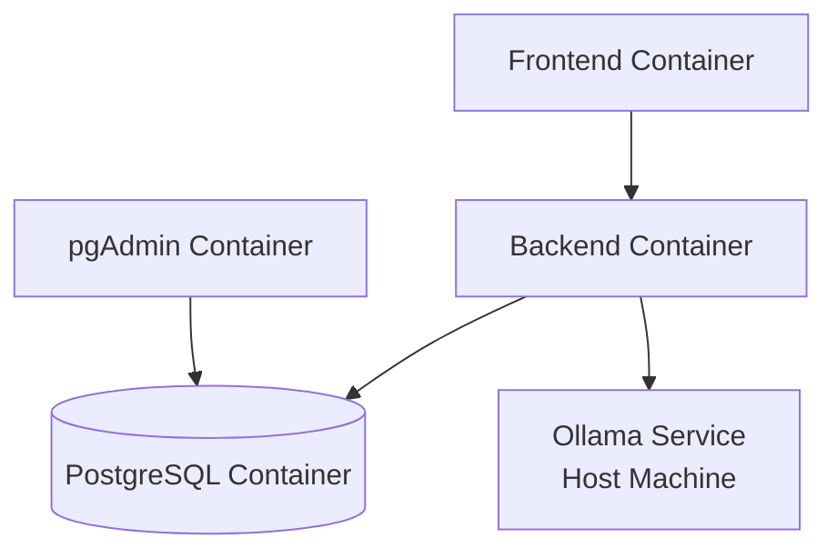

# Story 1.5: Create Docker Compose for Full Docker Deployment

## Status

Draft

## Story

**As a** developer,
**I want** Docker Compose orchestration for all services (database, backend, frontend, pgAdmin) with Dockerfiles for containerized deployment,
**so that** I can run the entire application stack with a single `docker-compose up` command with hot reload support.

## Acceptance Criteria

1. **Backend Dockerfile Created**:
   - [ ] `backend/Dockerfile` created with Python 3.11-slim base image
   - [ ] Python dependencies installed from `requirements.txt`
   - [ ] Application code copied to `/app` working directory
   - [ ] Port 8000 exposed
   - [ ] Default command runs uvicorn with hot reload

2. **Frontend Dockerfile Created**:
   - [ ] `frontend/Dockerfile` created with Node 18-alpine base image
   - [ ] Node dependencies installed from `package.json`
   - [ ] Application code copied to `/app` working directory
   - [ ] Port 3000 exposed
   - [ ] Default command runs Vite dev server

3. **docker-compose.yml Updated with All Services**:
   - [ ] Backend service added with build context and volume mounts
   - [ ] Frontend service added with build context and volume mounts
   - [ ] Service dependencies configured: frontend → backend → db
   - [ ] Health checks configured for backend service
   - [ ] All 4 services (db, backend, frontend, pgadmin) defined

4. **Hot Reload Working in Full Docker Mode**:
   - [ ] Backend volume mount: `./backend:/app` enables hot reload
   - [ ] Frontend volume mount: `./frontend:/app` enables hot reload
   - [ ] `node_modules` excluded from frontend volume mount
   - [ ] Code changes in backend/frontend trigger automatic reload

5. **Full Docker Deployment Verified**:
   - [ ] `docker-compose up --build` starts all 4 services successfully
   - [ ] All services show healthy status: `docker-compose ps`
   - [ ] Backend accessible at `http://localhost:8000/api/health`
   - [ ] Frontend accessible at `http://localhost:3000`
   - [ ] pgAdmin accessible at `http://localhost:5050`
   - [ ] Database accessible to backend

## Tasks / Subtasks

- [ ] **Task 1: Create Backend Dockerfile** (AC: 1)
  - [ ] Create `backend/Dockerfile` with Python 3.11-slim base
  - [ ] Install system dependencies: `build-essential`, `libpq-dev`
  - [ ] Copy `requirements.txt` and install Python dependencies
  - [ ] Copy application code to `/app`
  - [ ] Expose port 8000
  - [ ] Set default CMD: `uvicorn app.main:app --host 0.0.0.0 --port 8000`

- [ ] **Task 2: Create Frontend Dockerfile** (AC: 2)
  - [ ] Create `frontend/Dockerfile` with Node 18-alpine base
  - [ ] Set working directory to `/app`
  - [ ] Copy `package.json` and `package-lock.json`
  - [ ] Run `npm ci` to install dependencies
  - [ ] Copy application code to `/app`
  - [ ] Expose port 3000
  - [ ] Set default CMD: `npm run dev -- --host 0.0.0.0`

- [ ] **Task 3: Add Backend Service to docker-compose.yml** (AC: 3)
  - [ ] Define `backend` service with build context `./backend`
  - [ ] Set environment variables: DATABASE_URL, OLLAMA_ENDPOINT_URL, CORS_ORIGINS
  - [ ] Expose port 8000
  - [ ] Add volume mount: `./backend:/app` for hot reload
  - [ ] Set dependency: `depends_on: db (condition: service_healthy)`
  - [ ] Override CMD: Run Alembic migrations then start uvicorn with `--reload`

- [ ] **Task 4: Add Frontend Service to docker-compose.yml** (AC: 3)
  - [ ] Define `frontend` service with build context `./frontend`
  - [ ] Set environment variable: VITE_BACKEND_URL
  - [ ] Expose port 3000
  - [ ] Add volume mounts: `./frontend:/app` and `/app/node_modules` (exclude)
  - [ ] Set dependency: `depends_on: backend`
  - [ ] Override CMD: `npm run dev -- --host 0.0.0.0 --port 3000`

- [ ] **Task 5: Configure Service Dependencies and Health Checks** (AC: 3)
  - [ ] Ensure `db` service has health check (already exists from Story 1.2)
  - [ ] Configure backend dependency on db with `condition: service_healthy`
  - [ ] Configure frontend dependency on backend
  - [ ] Verify service startup order: db → backend → frontend

- [ ] **Task 6: Verify Full Docker Deployment** (AC: 4, 5)
  - [ ] Build Docker images: `docker-compose build --no-cache`
  - [ ] Start all services: `docker-compose up`
  - [ ] Verify service status: `docker-compose ps` (all running/healthy)
  - [ ] Test backend health: `curl http://localhost:8000/api/health`
  - [ ] Test frontend: `open http://localhost:3000` (Hello BMADFlow displays)
  - [ ] Test hot reload: Edit backend/frontend code, verify auto-reload
  - [ ] Test pgAdmin: `open http://localhost:5050` (connect to database)

## Dev Notes

### Deployment Architecture

**Full Docker Mode**: All services (frontend, backend, PostgreSQL, pgAdmin) run in Docker containers with volume mounts for hot reload.

[Source: architecture/deployment.md#full-docker-deployment]

**Service Dependencies**:


[Source: architecture/deployment.md#architecture]

### Backend Dockerfile

**File**: `backend/Dockerfile`

```dockerfile
FROM python:3.11-slim

WORKDIR /app

# Install system dependencies
RUN apt-get update && apt-get install -y \
    build-essential \
    libpq-dev \
    && rm -rf /var/lib/apt/lists/*

# Copy requirements and install dependencies
COPY requirements.txt .
RUN pip install --no-cache-dir -r requirements.txt

# Copy application code
COPY . .

# Expose port
EXPOSE 8000

# Default command (can be overridden in docker-compose.yml)
CMD ["uvicorn", "app.main:app", "--host", "0.0.0.0", "--port", "8000"]
```

[Source: architecture/deployment.md#backend-dockerfile]

**Key Considerations**:
- Use `python:3.11-slim` for smaller image size
- Install `libpq-dev` for PostgreSQL driver (asyncpg)
- `--no-cache-dir` reduces image size
- Default CMD can be overridden in docker-compose.yml for `--reload`

### Frontend Dockerfile

**File**: `frontend/Dockerfile`

```dockerfile
FROM node:18-alpine

WORKDIR /app

# Copy package files and install dependencies
COPY package*.json ./
RUN npm ci

# Copy application code
COPY . .

# Expose port
EXPOSE 3000

# Default command (can be overridden in docker-compose.yml)
CMD ["npm", "run", "dev", "--", "--host", "0.0.0.0"]
```

[Source: architecture/deployment.md#frontend-dockerfile]

**Key Considerations**:
- Use `node:18-alpine` for minimal image size
- `npm ci` for faster, deterministic installs
- `--host 0.0.0.0` allows access from outside container

### docker-compose.yml with All Services

**Complete Configuration**:

```yaml
version: '3.8'

services:
  # PostgreSQL with pgvector (from Story 1.2)
  db:
    image: ankane/pgvector:latest
    container_name: bmadflow-db
    environment:
      POSTGRES_USER: ${POSTGRES_USER:-bmadflow}
      POSTGRES_PASSWORD: ${POSTGRES_PASSWORD:-changeme}
      POSTGRES_DB: ${POSTGRES_DB:-bmadflow}
    ports:
      - "${POSTGRES_PORT:-5432}:5432"
    volumes:
      - postgres_data:/var/lib/postgresql/data
    healthcheck:
      test: ["CMD-SHELL", "pg_isready -U ${POSTGRES_USER:-bmadflow}"]
      interval: 5s
      timeout: 5s
      retries: 5
    networks:
      - bmadflow-network

  # Backend (FastAPI)
  backend:
    build:
      context: ./backend
      dockerfile: Dockerfile
    container_name: bmadflow-backend
    environment:
      DATABASE_URL: postgresql+asyncpg://${POSTGRES_USER:-bmadflow}:${POSTGRES_PASSWORD:-changeme}@db:5432/${POSTGRES_DB:-bmadflow}
      OLLAMA_ENDPOINT_URL: ${OLLAMA_ENDPOINT_URL:-http://host.docker.internal:11434}
      BACKEND_PORT: ${BACKEND_PORT:-8000}
      CORS_ORIGINS: http://localhost:${FRONTEND_PORT:-3000}
      LOG_LEVEL: ${LOG_LEVEL:-INFO}
      OPENAI_API_KEY: ${OPENAI_API_KEY:-}
      GOOGLE_API_KEY: ${GOOGLE_API_KEY:-}
    ports:
      - "${BACKEND_PORT:-8000}:8000"
    volumes:
      - ./backend:/app  # Hot reload support
    depends_on:
      db:
        condition: service_healthy
    command: >
      sh -c "alembic upgrade head &&
             uvicorn app.main:app --host 0.0.0.0 --port 8000 --reload"
    networks:
      - bmadflow-network

  # Frontend (React + Vite)
  frontend:
    build:
      context: ./frontend
      dockerfile: Dockerfile
    container_name: bmadflow-frontend
    environment:
      VITE_BACKEND_URL: http://localhost:${BACKEND_PORT:-8000}
    ports:
      - "${FRONTEND_PORT:-3000}:3000"
    volumes:
      - ./frontend:/app  # Hot reload support
      - /app/node_modules  # Avoid overwriting node_modules
    depends_on:
      - backend
    command: npm run dev -- --host 0.0.0.0 --port 3000
    networks:
      - bmadflow-network

  # pgAdmin (Database Admin UI) (from Story 1.2)
  pgadmin:
    image: dpage/pgadmin4:latest
    container_name: bmadflow-pgadmin
    environment:
      PGADMIN_DEFAULT_EMAIL: admin@bmadflow.local
      PGADMIN_DEFAULT_PASSWORD: admin
      PGADMIN_CONFIG_SERVER_MODE: 'False'  # No auth for POC
      PGADMIN_CONFIG_MASTER_PASSWORD_REQUIRED: 'False'
    ports:
      - "${PGADMIN_PORT:-5050}:80"
    depends_on:
      - db
    networks:
      - bmadflow-network

volumes:
  postgres_data:

networks:
  bmadflow-network:
    driver: bridge
```

[Source: architecture/deployment.md#docker-compose-configuration]

### Hot Reload Configuration

**Backend Hot Reload**:
- Volume mount: `./backend:/app` maps local code to container
- uvicorn `--reload` flag watches for file changes
- Code changes trigger automatic server restart

**Frontend Hot Reload**:
- Volume mount: `./frontend:/app` maps local code to container
- **Critical**: `/app/node_modules` anonymous volume prevents host node_modules from overwriting container node_modules
- Vite HMR detects file changes and updates browser without refresh

[Source: architecture/deployment.md#hot-reload-performance]

**Volume Mount Syntax**:
```yaml
volumes:
  - ./frontend:/app           # Mount source code
  - /app/node_modules         # Exclude node_modules (anonymous volume)
```

### Service Startup Order

**Dependency Chain**:
1. `db` starts first (no dependencies)
2. `backend` waits for `db` health check to pass
3. `frontend` waits for `backend` to start
4. `pgadmin` starts after `db`

**Health Check Strategy**:
- `db` has health check: `pg_isready` command
- `backend` depends on `db` with `condition: service_healthy`
- `frontend` has simple dependency on `backend` (no health check)

[Source: architecture/deployment.md#docker-compose-configuration]

### Environment Variables

**Updated .env** (for Full Docker mode):
```bash
# Database Configuration
POSTGRES_USER=bmadflow
POSTGRES_PASSWORD=changeme_in_production
POSTGRES_DB=bmadflow

# Port Configuration
FRONTEND_PORT=3000
BACKEND_PORT=8000
POSTGRES_PORT=5432
PGADMIN_PORT=5050

# Ollama Configuration (host machine)
OLLAMA_ENDPOINT_URL=http://host.docker.internal:11434
EMBEDDING_MODEL=nomic-embed-text

# LLM Provider API Keys (Optional)
OPENAI_API_KEY=
GOOGLE_API_KEY=

# Application Configuration
LOG_LEVEL=INFO
```

[Source: architecture/deployment.md#environment-variables]

**Critical**: Backend DATABASE_URL uses `@db:5432` (Docker network hostname), OLLAMA uses `host.docker.internal:11434` (host machine).

### Ollama Configuration

**Prerequisite**: Ollama must be running on host machine with `nomic-embed-text` model.

**Docker → Host Access**: Use `host.docker.internal:11434` to access Ollama service running on host machine from Docker container.

**Verification**:
```bash
# Verify Ollama accessible from container
docker exec bmadflow-backend curl http://host.docker.internal:11434/api/tags
```

[Source: architecture/deployment.md#ollama-connection-refused]

### Deployment Commands

**Build and Start All Services**:
```bash
docker-compose up --build
```

**Start in Detached Mode**:
```bash
docker-compose up -d --build
```

**Check Service Status**:
```bash
docker-compose ps

# Expected output:
# NAME                STATUS    PORTS
# bmadflow-db         Up (healthy)        0.0.0.0:5432->5432/tcp
# bmadflow-backend    Up                  0.0.0.0:8000->8000/tcp
# bmadflow-frontend   Up                  0.0.0.0:3000->3000/tcp
# bmadflow-pgadmin    Up                  0.0.0.0:5050->80/tcp
```

**View Logs**:
```bash
# All services
docker-compose logs -f

# Specific service
docker-compose logs -f backend
docker-compose logs -f frontend
```

**Stop Services**:
```bash
# Stop but preserve data
docker-compose down

# Stop and remove volumes (deletes database)
docker-compose down -v
```

[Source: architecture/deployment.md#deployment-steps]

### Testing

#### Testing Standards

**Integration Testing**:
- Verify all 4 services start successfully
- Verify service dependencies (backend waits for db)
- Verify health checks pass
- Verify frontend can reach backend API
- Verify backend can reach database
- Verify hot reload works for backend and frontend

**Manual Testing**:
```bash
# Build and start
docker-compose up --build

# Verify service status (wait 30s for startup)
docker-compose ps

# Test backend health
curl http://localhost:8000/api/health
# Expected: {"status": "ok", "database": "connected", "timestamp": "..."}

# Test frontend
open http://localhost:3000
# Expected: "Hello BMADFlow" page displays

# Test hot reload - Backend
# Edit backend/app/api/v1/health.py, add comment
# Watch logs: docker-compose logs -f backend
# Expected: "Detected file change, reloading..."

# Test hot reload - Frontend
# Edit frontend/src/pages/Dashboard.tsx, change text
# Expected: Browser updates automatically (HMR)

# Test pgAdmin
open http://localhost:5050
# Add server: Host=db, Port=5432, User=bmadflow, Password=changeme
# Expected: Connection successful
```

[Source: architecture/testing-strategy.md#integration-tests]

**No E2E Tests Required**: E2E tests will be added in Story 1.6.

## Change Log

| Date | Version | Description | Author |
|------|---------|-------------|--------|
| 2025-10-06 | 1.0 | Initial story draft created | Bob (Scrum Master) |

## Dev Agent Record

### Agent Model Used

_To be filled by Dev Agent_

### Debug Log References

_To be filled by Dev Agent_

### Completion Notes

_To be filled by Dev Agent_

### File List

_To be filled by Dev Agent_

## QA Results

_To be filled by QA Agent_
