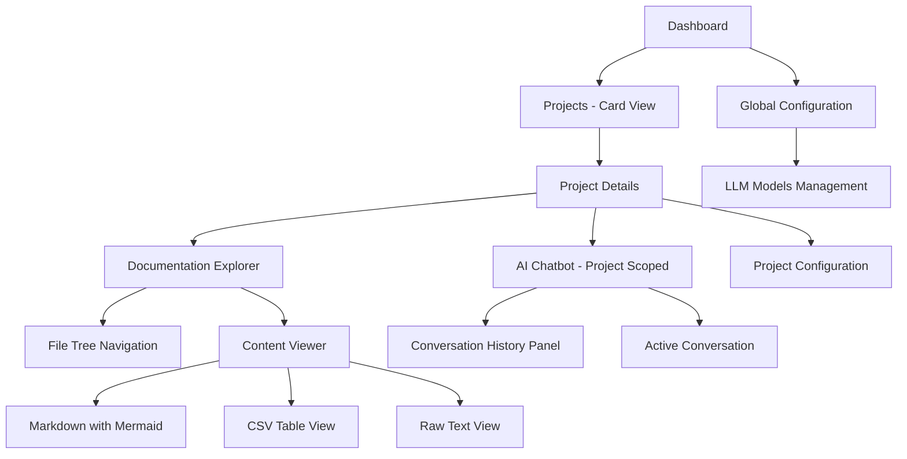
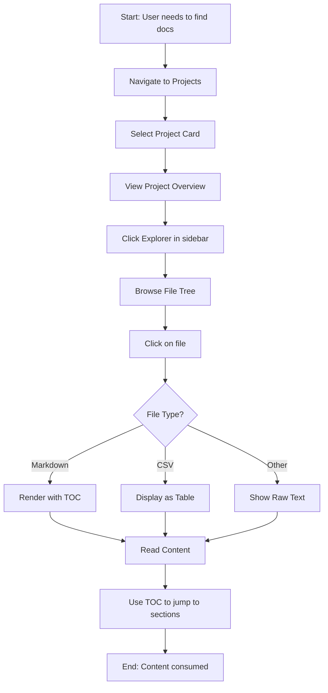
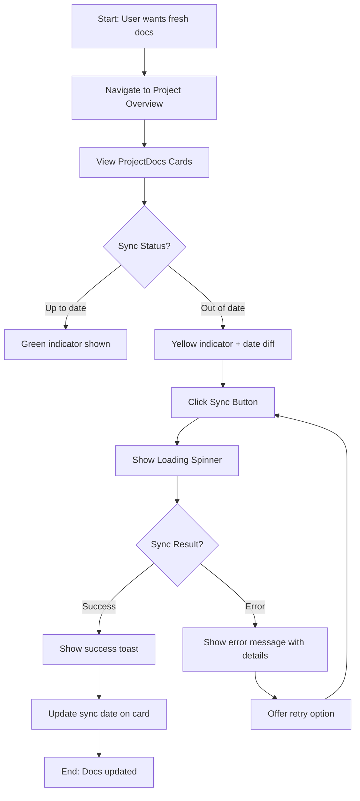
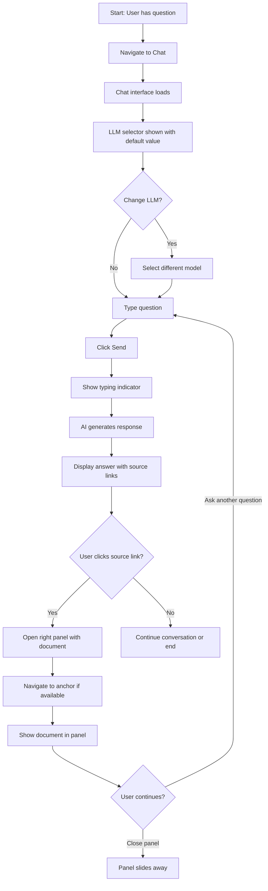

# BMADFlow UI/UX Specification

**Project:** BMADFlow - Centralized BMAD Method Documentation Platform
**Version:** 1.0
**Date:** 2025-10-06
**Author:** Sally - UX Expert

---

## 1. Introduction

This document defines the user experience goals, information architecture, user flows, and visual design specifications for BMADFlow's user interface. It serves as the foundation for frontend development, ensuring a cohesive and user-centered experience.

### Document Purpose

BMADFlow addresses the challenge of centralizing and efficiently exploring technical documentation generated across multiple projects using Claude Code and the BMAD Method framework. This specification focuses on creating a developer-first tool optimized for rapid documentation discovery and intelligent exploration.

### Base Template

**shadcn/ui Dashboard Template** (https://ui.shadcn.com/examples/dashboard)

- Provides sidebar navigation, header with breadcrumbs, and main content area
- Built on React + TypeScript + Tailwind CSS
- Professional, accessible component library

---

## 2. Overall UX Goals & Principles

### Target User Personas

#### Primary Persona: Alex - The BMAD Developer

- Technical professional using Claude Code and BMAD Method
- Works on multiple projects simultaneously
- Needs quick access to documentation across repositories
- Values efficiency and minimal context switching
- Comfortable with technical interfaces

#### Secondary Persona: Jordan - The Product Owner

- Manages BMAD projects and needs oversight
- Reviews documentation and project status
- Less technical than developers but understands concepts
- Needs clear visual organization and status indicators

#### Tertiary Persona: Sam - The Technical Architect

- Consults project documentation to understand patterns
- Looks for architectural decisions across projects
- Needs deep-dive capabilities and cross-project insights
- Values search and discovery features

### Usability Goals

1. **Rapid Documentation Discovery** - Users can find relevant documentation across all projects in under 30 seconds
2. **Zero Learning Curve for Developers** - Familiar file tree interface requires no training
3. **Intelligent Search** - Natural language queries return relevant results immediately
4. **Minimal Clicks** - Common workflows (browse → find → read) require ≤3 clicks
5. **Always Available** - Local deployment means no internet dependency for core features

### Design Principles

1. **Developer-First Experience** - Prioritize speed and efficiency over visual polish
2. **Information Density** - Show maximum relevant information without clutter
3. **Familiar Patterns** - Use conventions from IDEs and code editors (GitHub-like)
4. **Progressive Disclosure** - Start simple, reveal complexity on demand
5. **Honest Feedback** - Clear sync status, error messages, and system state

---

## 3. Information Architecture

### Site Map / Screen Inventory



### Navigation Structure

**Sidebar Navigation** (shadcn template left sidebar, always visible):

- 🏠 **Dashboard** - Overview and metrics
- 📁 **Projects** - Card grid view
- ⚙️ **Configuration** - Global LLM settings

**Project Context Navigation** (appears in sidebar when project selected):

- 📄 **Overview** - Project info + ProjectDocs cards
- 🗂️ **Explorer** - File tree + viewer
- 💬 **Chat** - AI assistant (project-scoped)
- ⚙️ **Settings** - Project configuration

**Breadcrumb Strategy** (in top header, always visible):

- Dashboard
- Projects
- [Project Name] > Overview
- [Project Name] > Explorer > [File Path]
- [Project Name] > Chat

### Core Screens and Views

1. **Dashboard** - Project overview with metrics
2. **Projects - Card View** - Grid of project cards
3. **Project Details (Overview)** - Project info + ProjectDocs cards
4. **Documentation Explorer** - Split view: file tree (left) + content viewer (right)
5. **AI Chatbot Interface** - Chat with right panel for sources/history
6. **Global Configuration** - LLM model management

---

## 4. User Flows

### Flow 1: Browse and Read Documentation

**User Goal:** Find and read specific documentation across projects
**Entry Points:** Dashboard → Projects → Select Project
**Success Criteria:** User finds and reads target documentation in under 1 minute



**Edge Cases & Error Handling:**

- File fails to load → Show error message with retry button
- Large file (>5MB) → Show loading indicator, warn user
- Empty file → Display "This file is empty" message
- Broken relative links in markdown → Display link but disable navigation, show tooltip

---

### Flow 2: Sync Documentation from GitHub

**User Goal:** Update local documentation with latest from GitHub
**Entry Points:** Project Overview page → ProjectDocs card sync button
**Success Criteria:** Documentation synced successfully with clear status feedback



**Edge Cases & Error Handling:**

- GitHub rate limit reached → Show clear error with time until reset
- Invalid GitHub URL → Validate on ProjectDocs creation, prevent sync
- Network error → Display retry button with helpful message
- Partial sync failure → Show which files succeeded/failed

---

### Flow 3: Query Documentation with AI Chatbot

**User Goal:** Ask questions about project documentation using natural language
**Entry Points:** Project context → Click Chat in sidebar
**Success Criteria:** User receives relevant answer with source attribution in under 10 seconds



**Source Panel Behavior:**

- Slides in from right when source link clicked (40% width)
- Shows file path at top with close button
- Renders markdown/CSV/text appropriately
- If anchor exists, auto-scrolls to that section
- If anchor missing, shows document from top + toast: "Navigated to document root"
- Includes "Open in Explorer" button at bottom
- Panel remains open until user closes it or clicks different source
- User can still scroll chat and ask questions while panel is open

**History Panel Behavior:**

- Clicking "History" button opens right panel (40% width)
- Shows last 10 conversations as cards
- Each card: User question (truncated if long), timestamp, LLM used
- Clicking card loads that conversation and closes panel
- Sorted by most recent first

**Edge Cases & Error Handling:**

- No LLM configured → Show error: "No default LLM configured. Please set one in Configuration."
- LLM request fails → Display error with retry button
- No relevant documents found → AI responds "No relevant documentation found for this query in this project"
- Source file not found → Show error in panel: "Source file no longer exists. Please resync ProjectDocs."
- Very long response → Stream response token by token for better perceived performance

---

## 5. Key Screen Layouts

### Screen 1: Dashboard

**Purpose:** Quick overview of system status and activity

**Layout:**
```
+--------------------------------------------------+
| Sidebar | Top Bar (Breadcrumb: Dashboard)        |
|---------|------------------------------------------|
| 🏠 Dash | Metrics Cards Row:                       |
| 📁 Proj | +--------+ +--------+ +--------+         |
| ⚙️ Conf | | Total  | | Total  | | Total  |         |
|         | | Proj   | | Files  | | Chunks |         |
|         | |   10   | |  1,234 | | 45,678 |         |
|         | +--------+ +--------+ +--------+         |
|         |                                          |
|         | Recent Activity (last 10 syncs)          |
|         | - Project X synced 2 hours ago           |
|         | - Project Y synced 5 hours ago           |
|         |                                          |
+--------------------------------------------------+
```

**Key Elements:**

- Three metric cards: Total Projects, Total Doc Files, Total Chunks
- Recent activity feed (simple list)
- shadcn Card components for metrics
- shadcn Table for activity list

---

### Screen 2: Projects - Card View

**Purpose:** Browse and select projects

**Layout:**
```
+--------------------------------------------------+
| Sidebar | Top Bar (Breadcrumb: Projects)          |
|---------|------------------------------------------|
| 🏠 Dash | Search: [____________]                   |
| 📁 Proj |                                          |
| ⚙️ Conf | +------------+ +------------+             |
|         | | Project A  | | Project B  |             |
|         | | 3 Docs     | | 2 Docs     |             |
|         | | Last sync: | | Last sync: |             |
|         | | 2h ago     | | 1d ago     |             |
|         | | [View]     | | [View]     |             |
|         | +------------+ +------------+             |
|         |                                          |
|         | +------------+ +------------+             |
|         | | Project C  | | + New      |             |
|         | | 5 Docs     | | Project    |             |
|         | +------------+ +------------+             |
+--------------------------------------------------+
```

**Key Elements:**

- Search bar at top
- Grid of project cards (shadcn Card component)
- Each card: Project name, # of ProjectDocs, last sync time, View button
- "+ New Project" card for creation
- Responsive grid (2-3 columns based on screen width)

---

### Screen 3: Project Overview

**Purpose:** Show project details and manage ProjectDocs

**Layout:**
```
+--------------------------------------------------+
| Sidebar     | Top Bar (Breadcrumb: Projects >     |
|             | BMADFlow)                            |
|-------------|--------------------------------------|
| 🏠 Dash     | Project: BMADFlow                    |
| 📁 Proj     | Description: [project description]   |
|             |                                      |
| [BMADFlow]  | ProjectDocs:                         |
| 📄 Overview | +---------------+ +---------------+  |
| 🗂️ Explorer | | Doc Repo 1    | | Doc Repo 2    |  |
| 💬 Chat     | | GitHub: [link]| | GitHub: [link]|  |
| ⚙️ Settings | | Last: 2h ago  | | Last: 1d ago  |  |
|             | | ✓ Up to date  | | ⚠️ Update     |  |
|             | | [Sync]        | | [Sync]        |  |
|             | +---------------+ +---------------+  |
|             |                                      |
|             | [+ Add ProjectDoc]                   |
+--------------------------------------------------+
```

**Key Elements:**

- Project name and description at top
- ProjectDocs displayed as cards
- Each card: Name, GitHub link, last sync time, status indicator, Sync button
- Status indicators: ✓ (green) up to date, ⚠️ (yellow) needs update
- Add ProjectDoc button
- Sidebar shows project-specific navigation when project selected

---

### Screen 4: Documentation Explorer

**Purpose:** Browse and read documentation files

**Layout:**
```
+--------------------------------------------------+
| Sidebar     | Top Bar (Breadcrumb: Projects >     |
|             | BMADFlow > Explorer > docs/prd.md)   |
|-------------|--------------------------------------|
| 🏠 Dash     | +----------+-------------------------+|
| 📁 Proj     | | Tree     | Content                ||
|             | |----------|-------------------------||
| [BMADFlow]  | | 📁 docs  | # Product Requirements  ||
| 📄 Overview | |  📄 prd  | Table of Contents:      ||
| 🗂️ Explorer | |  📄 arch |  - Goals                ||
| 💬 Chat     | | 📁 src   |  - Requirements         ||
| ⚙️ Settings | |  📁 api  |  - Epics                ||
|             | |  📁 ui   |                         ||
|             | |          | ## Goals                ||
|             | |          | [markdown content...]   ||
|             | |          |                         ||
|             | +----------+-------------------------+|
+--------------------------------------------------+
```

**Key Elements:**

- Split view: File tree (left, ~25%) + Content viewer (right, ~75%)
- File tree uses pre-built library (react-arborist)
- For markdown: Auto-generated TOC at top, then content
- TOC links jump to sections within content
- Syntax highlighting for code blocks
- Mermaid diagram rendering
- CSV files render as tables
- File tree can be collapsed for more content space

---

### Screen 5: AI Chatbot with Source/History Panel

**Purpose:** Query documentation with AI and view sources

**Default Layout (New Conversation):**
```
+--------------------------------------------------+
| Sidebar     | Top Bar (Breadcrumb: Projects >     |
|             | BMADFlow > Chat)                     |
|-------------|--------------------------------------|
| 🏠 Dash     | +----------------------------------+ |
| 📁 Proj     | | LLM: [llama2 ▼]  [History]       | |
|             | +----------------------------------+ |
| [BMADFlow]  |                                      |
| 📄 Overview | New Conversation                     |
| 🗂️ Explorer |                                      |
| 💬 Chat     | Ask a question about this project... |
| ⚙️ Settings |                                      |
|             | [_____________________________]      |
|             | [Send]                               |
|             |                                      |
+--------------------------------------------------+
```

**Active Conversation with Source Panel:**
```
+--------------------------------------------------+
| Sidebar     | Top Bar (Breadcrumb: Projects >     |
|             | BMADFlow > Chat)                     |
|-------------|--------------------------------------|
| 🏠 Dash     | LLM: [llama2▼] [History] [New]       |
| 📁 Proj     | Chat          | Source Panel         |
|             |---------------|---------------------|
| [BMADFlow]  | User: What are| [X] Close           |
| 📄 Overview | the main goals| Path: docs/prd.md   |
| 🗂️ Explorer |               |                     |
| 💬 Chat     | AI: The main  | ## Goals            |
| ⚙️ Settings | goals are...  | [markdown content]  |
|             |               |                     |
|             | Sources:      | [Open in Explorer]  |
|             | [📄 prd.md]   |                     |
|             |               |                     |
|             | [__________]  |                     |
|             | [Send]        |                     |
+--------------------------------------------------+
     60% width (or 100% if no panel)    40% width
```

**Active Conversation with History Panel:**
```
+--------------------------------------------------+
| Sidebar     | Top Bar (Breadcrumb: Projects >     |
|             | BMADFlow > Chat)                     |
|-------------|--------------------------------------|
| 🏠 Dash     | LLM: [llama2▼] [History] [New]       |
| 📁 Proj     | Chat          | Conversation History|
|             |---------------|---------------------|
| [BMADFlow]  | User: What are| [X] Close           |
| 📄 Overview | the main goals|                     |
| 🗂️ Explorer |               | +----------------+ |
| 💬 Chat     | AI: The main  | | What are the  | |
| ⚙️ Settings | goals are...  | | main goals?   | |
|             |               | | 2 hours ago   | |
|             | Sources:      | | llama2        | |
|             | [📄 prd.md]   | +----------------+ |
|             |               |                     |
|             | [__________]  | +----------------+ |
|             | [Send]        | | How does sync | |
|             |               | | work?         | |
|             |               | | 1 day ago     | |
|             |               | | llama2        | |
|             |               | +----------------+ |
+--------------------------------------------------+
     60% width                      40% width
```

**Key Elements:**

- LLM selector dropdown at top (remembers user selection)
- "History" button opens right panel with last 10 conversations
- "New" button appears when viewing past conversation
- Source links displayed at end of AI responses
- Right panel (40% width) for sources or history
- Source panel shows: file path, close button, content, "Open in Explorer" button
- History panel shows: conversation cards (question, timestamp, LLM)
- Panel closes only via X button
- Fixed 60/40 split for POC simplicity
- Conversation history stored in database

---

### Screen 6: Global Configuration

**Purpose:** Manage LLM models

**Layout:**
```
+--------------------------------------------------+
| Sidebar | Top Bar (Breadcrumb: Configuration)    |
|---------|------------------------------------------|
| 🏠 Dash | LLM Models                               |
| 📁 Proj |                                          |
| ⚙️ Conf | Configured Models:                       |
|         | +----------------------------------+     |
|         | | Provider | Model    | Default  |     |
|         | |----------|----------|----------|     |
|         | | Ollama   | llama2   | ✓        |     |
|         | +----------------------------------+     |
|         |                                          |
|         | [+ Add New Model]                        |
|         |                                          |
+--------------------------------------------------+
```

**Key Elements:**

- Table showing configured LLM models
- Columns: Provider, Model Name, Default (checkbox)
- Add New Model button opens dialog/form
- For POC: Likely shows just one pre-configured model

---

## 6. Component Library / Design System

### Design System Approach

**Base:** shadcn/ui components (https://ui.shadcn.com/)

- Pre-built, accessible components
- Tailwind CSS based
- Light mode only for POC
- Copy-paste component model

### Core shadcn Components Used

**Layout:**
- Sidebar, Header, Card, Separator

**Data Display:**
- Table, Badge

**Input:**
- Input, Button, Select/Dropdown, Dialog/Modal

**Navigation:**
- Tree View (pre-built library: react-arborist)

**Feedback:**
- Toast, Skeleton/Spinner, Alert

### Custom Components (To Be Built)

1. **ChatMessage** - User/AI message bubbles
2. **SourcePanel** - Reusable right panel (Source/History modes)
3. **ConversationCard** - History panel item
4. **MarkdownRenderer** - Markdown with TOC, Mermaid, syntax highlighting
5. **FileTreeNode** - Tree item for files/folders

### Component States

- **Button:** Default, Hover, Active, Disabled, Loading
- **Card:** Default, Hover (if clickable), Selected
- **Input:** Default, Focus, Error, Disabled
- **Panel:** Closed, Opening (slide-in), Open, Closing (slide-out)

### Usage Guidelines

**Buttons:**
- Primary: `variant="default"` (Send, Sync)
- Secondary: `variant="outline"` (Cancel, Close)
- Destructive: `variant="destructive"` (Delete)
- Ghost: `variant="ghost"` (icon-only)

**Spacing:**
- Standard padding: `p-4` or `p-6` for cards
- Standard gap: `gap-4` between elements

---

## 7. Branding & Style Guide

### Visual Identity

**Brand Guidelines:** GitHub-inspired aesthetic

- Clean, professional developer tool
- Focus on readability and information density

### Color Palette

| Color Type | Hex Code | Usage |
|------------|----------|-------|
| Primary | #0969da | Primary actions, links, active states |
| Secondary | #6e7781 | Secondary text, icons |
| Accent | #0969da | Highlights, focus states |
| Success | #1a7f37 | Sync success, up-to-date indicators |
| Warning | #bf8700 | Needs update, caution states |
| Error | #cf222e | Errors, failed syncs, destructive actions |
| Neutral Gray 50 | #f6f8fa | Background, panels |
| Neutral Gray 100 | #eaeef2 | Borders, dividers |
| Neutral Gray 500 | #57606a | Muted text, disabled states |
| Neutral Gray 900 | #24292f | Primary text |
| White | #ffffff | Card backgrounds, input fields |

### Typography

**Font Families:**

- **Primary:** `-apple-system, BlinkMacSystemFont, "Segoe UI", Roboto, sans-serif` (System font stack)
- **Monospace:** `ui-monospace, SFMono-Regular, "SF Mono", Menlo, Consolas, monospace`

**Type Scale:**

| Element | Size | Weight | Line Height | Usage |
|---------|------|--------|-------------|-------|
| H1 | 32px (2rem) | 700 (Bold) | 1.25 | Page titles |
| H2 | 24px (1.5rem) | 600 (Semibold) | 1.33 | Section headers |
| H3 | 20px (1.25rem) | 600 (Semibold) | 1.4 | Subsection headers |
| Body | 14px (0.875rem) | 400 (Regular) | 1.5 | Default text |
| Body Large | 16px (1rem) | 400 (Regular) | 1.5 | Emphasized content |
| Small | 12px (0.75rem) | 400 (Regular) | 1.5 | Metadata, timestamps |
| Code | 13px (0.8125rem) | 400 (Regular) | 1.6 | Code blocks |

### Iconography

**Icon Library:** Lucide Icons (https://lucide.dev/)

**Common Icons:**

- Home, Folder/FolderOpen, File/FileText, MessageSquare, Settings
- RefreshCw (Sync), Check/CheckCircle (Success)
- AlertTriangle (Warning), X (Close - neutral gray only)
- XCircle (Error - red only), Search, Plus, BarChart, Link

**Icon Styling:**

- **X Icon (Close):** Neutral gray (`text-gray-500`), hover darker, **never red**
- **XCircle Icon (Error):** Error red (`text-red-600`) only
- Default size: 16px (inline), 20px (prominent actions)

### Spacing & Layout

**Spacing Scale:**

- `spacing-4`: 1rem (16px) - Default spacing
- `spacing-6`: 1.5rem (24px) - Comfortable spacing
- `spacing-8`: 2rem (32px) - Generous spacing

**Fixed Positioning:**

- **Header:** `position: fixed`, `top: 0`, `z-index: 50`
- **Sidebar:** `position: fixed`, `left: 0`, `top: [header-height]`, `z-index: 40`, `width: 240px`
- **Main content:** `margin-left: 240px`, `margin-top: [header-height]`

**Shadows:**

- Card: `shadow-sm`
- Dropdown/Modal: `shadow-md`
- Panel overlay: `shadow-lg`

**Border Radius:**

- Default: `rounded-md` (6px)
- Small: `rounded-sm` (2px)
- Large: `rounded-lg` (8px)

---

## 8. Responsive Design

**Target:** Desktop-first (POC focused on developer workstations)

### Breakpoints

| Breakpoint | Min Width | Target |
|------------|-----------|--------|
| Desktop | 1024px | Primary target (optimized) |
| Tablet | 768-1023px | Limited support |
| Mobile | < 768px | Not supported in POC |

**Note:** If accessed on screens < 1024px, show message: "BMADFlow is optimized for desktop browsers (1024px width or larger)."

### Adaptation Patterns (Desktop 1024px+)

- Full sidebar visible
- Split views work as designed
- All features accessible
- Fixed header and sidebar always visible when scrolling

---

## 9. Accessibility

**Compliance Target:** WCAG 2.1 Level AA

### Key Requirements

**Visual:**
- Color contrast: 4.5:1 (normal text), 3:1 (large text)
- Focus indicators: 2px solid ring in primary color
- Text scalable to 200%

**Interaction:**
- Keyboard navigation: Tab through all interactive elements
- Screen reader: Proper ARIA labels, landmarks, live regions
- Touch targets: Minimum 44x44px (desktop-focused)

**Content:**
- Alt text for all icons (or aria-labels)
- Proper H1-H6 hierarchy
- All inputs have labels

### Testing

- axe DevTools browser extension
- Lighthouse accessibility audit
- Manual keyboard navigation

---

## 10. Performance Considerations

### Performance Goals

- **Page Load:** < 2 seconds
- **Interaction Response:** < 100ms
- **Document Rendering:** < 1 second
- **AI Response:** < 10 seconds (stream if possible)

### Optimization Strategies

**Code Splitting:**
- Lazy load Explorer and Chat views
- Load markdown renderer on demand
- Load Mermaid library when needed

**Data Optimization:**
- Virtualize file tree for large repos
- Limit conversation history (last 10)
- Debounce search inputs
- Cache rendered markdown

**Visual Performance:**
- CSS transforms for panel animations (hardware accelerated)
- Skeleton loaders for async content
- Lazy load images in markdown

---

## Change Log

| Date | Version | Description | Author |
|------|---------|-------------|--------|
| 2025-10-06 | 1.0 | Initial UI/UX specification | Sally - UX Expert |

---

**End of Specification**
